<!-- TOC -->
* [smartDirectory (mission smart2)](#smartdirectory-mission-smart2)
  * [Problématique : la multiplication des smartContracts](#problématique--la-multiplication-des-smartcontracts)
  * [Le composant central de la solution proposée : le smartDirectory](#le-composant-central-de-la-solution-proposée--le-smartdirectory)
  * [Cas d'usages](#cas-dusages)
  * [Un composant auxiliaire : le tiers déployeur](#un-composant-auxiliaire--le-tiers-déployeur)
  * [Avantages et points de vigilance de la solution](#avantages-et-points-de-vigilance-de-la-solution)
    * [Les avantages](#les-avantages)
    * [Les points de vigilance](#les-points-de-vigilance)
  * [Les objectifs et ressources du projet](#les-objectifs-et-ressources-du-projet)
    * [Objectifs](#objectifs)
    * [Ressources](#ressources)
  * [Fonctionnement détaillé du smartDirectory](#fonctionnement-détaillé-du-smartdirectory)
    * [Le mode administré (parentsAuthorized)](#le-mode-administré-parentsauthorized)
    * [Le mode ouvert (selfDeclaration)](#le-mode-ouvert-selfdeclaration)
  * [Les structures du smartDirectory](#les-structures-du-smartdirectory)
    * [La table des références (references Table)](#la-table-des-références-references-table)
      * [.smartDirectoryReferenceEoaCreate](#smartdirectoryreferenceeoacreate)
      * [.smartDirectoryReferenceStatusEoaUpdate](#smartdirectoryreferencestatuseoaupdate)
      * [.smartDirectoryReferenceGet](#smartdirectoryreferenceget)
      * [.smartDirectoryReferenceLastStatusGet](#smartdirectoryreferencelaststatusget)
      * [.smartDirectoryReferenceStatusAtIndexGet](#smartdirectoryreferencestatusatindexget)
      * [.smartDirectoryReferencesListsGet](#smartdirectoryreferenceslistsget)
    * [La table des déclarants (registrants Table)](#la-table-des-déclarants-registrants-table)
      * [.smartDirectoryRegistrantEoaCreate](#smartdirectoryregistranteoacreate)
      * [.smartDirectoryRegistrantEoaDisable](#smartdirectoryregistranteoadisable)
      * [.smartDirectoryRegistrantUriEoaWrite](#smartdirectoryregistranturieoawrite)
      * [.smartDirectoryRegistrantUriGet](#smartdirectoryregistranturiget)
      * [.smartDirectoryRegistrantsDisabledListGet](#smartdirectoryregistrantsdisabledlistget)
      * [.smartDirectoryRegistrantLastIndexGet](#smartdirectoryregistrantlastindexget)
      * [.smartDirectoryRegistrantAtIndexGet](#smartdirectoryregistrantatindexget)
      * [.smartDirectoryRegistrantIndexGet](#smartdirectoryregistrantindexget)
      * [.smartDirectoryReferencesCountGet](#smartdirectoryreferencescountget)
  * [Création du smartDirectory](#création-du-smartdirectory)
    * [Les variables d'en-tête](#les-variables-den-tête)
    * [Les fonctions de management du SmartDirectory](#les-fonctions-de-management-du-smartdirectory)
      * [.smartDirectoryActivationCodeEoaUpdate](#smartdirectoryactivationcodeeoaupdate)
      * [.smartDirectoryHeadersGet](#smartdirectoryheadersget)
    * [API de création d'un smartDirectory](#api-de-création-dun-smartdirectory)
    * [Gestion du smartDirectory pour finaliser le déploiement](#gestion-du-smartdirectory-pour-finaliser-le-déploiement)
    * [Diffusion et import de l'adresse du smartDirectory](#diffusion-et-import-de-ladresse-du-smartdirectory)
  * [SmartTokens](#smarttokens)
    * [Cas d'utilisation](#cas-dutilisation)
    * [Paramétrage des smartTokens](#paramétrage-des-smarttokens)
    * [Déploiement pour tokenisation](#déploiement-pour-tokenisation)
    * [API de création d'un smartToken non fongible (smart721)](#api-de-création-dun-smarttoken-non-fongible-smart721)
    * [Lecture des variables du smart721](#lecture-des-variables-du-smart721)
      * [.smartToken721GetType](#smarttoken721gettype)
      * [.smartToken721GetParent1](#smarttoken721getparent1)
      * [.smartToken721GetParent2](#smarttoken721getparent2)
      * [.smartToken721GetMaxToken](#smarttoken721getmaxtoken)
      * [.smartToken721GetSmartDirectoryAddress](#smarttoken721getsmartdirectoryaddress)
      * [.smartToken721GetRegistrantAddress](#smarttoken721getregistrantaddress)
      * [.blockchainERC721name](#blockchainerc721name)
      * [.blockchainERC721symbol](#blockchainerc721symbol)
      * [.smartToken721GetVersion](#smarttoken721getversion)
    * [API de création d'un token fongible (smartErc20A)](#api-de-création-dun-token-fongible-smarterc20a)
    * [Lecture des variables du smartERC20A](#lecture-des-variables-du-smarterc20a)
      * [.blockchainERC20ReadVariables](#blockchainerc20readvariables)
      * [.smartTokenERC20AGetType](#smarttokenerc20agettype)
      * [.smartTokenERC20AGetParent1](#smarttokenerc20agetparent1)
      * [.smartTokenERC20AGetParent2](#smarttokenerc20agetparent2)
      * [.smartTokenERC20AGetSmartDirectoryAddress](#smarttokenerc20agetsmartdirectoryaddress)
      * [.smartTokenERC20AGetRegistrantAddress](#smarttokenerc20agetregistrantaddress)
      * [.smartTokenERC20AGetVersion](#smarttokenerc20agetversion)
  * [Plan de test](#plan-de-test)
    * [SmartDirectory administré](#smartdirectory-administré)
    * [SmartDirectory ouvert](#smartdirectory-ouvert)
    * [SmartToken721](#smarttoken721)
    * [SmartTokenErc20](#smarttokenerc20)
  * [Bilan économique](#bilan-économique)
* [App de démonstration du smartDirectory (alpha)](#app-de-démonstration-du-smartdirectory-alpha)
    * [Périmètre de l'application](#périmètre-de-lapplication)
    * [A propos d'App Inventor 2 (AI2)](#a-propos-dapp-inventor-2-ai2)
    * [Code source et recompilation de l'application](#code-source-et-recompilation-de-lapplication)
    * [Première ouverture de l'App](#première-ouverture-de-lapp)
    * [Le menu principal](#le-menu-principal)
  * [Menus Administrateur](#menus-administrateur)
    * [Deploy smartDirectory](#deploy-smartdirectory)
    * [Manage smartDirectory](#manage-smartdirectory)
  * [Menus "Registrant"](#menus-registrant)
    * [Import smartDirectory](#import-smartdirectory)
    * [My RegistrantAddress](#my-registrantaddress)
    * [Change Status Reference](#change-status-reference)
  * [Menus Utilisateur](#menus-utilisateur)
    * [Explore Ecosystems](#explore-ecosystems-)
    * [Scan Address in Ecosystem](#scan-address-in-ecosystem)
    * [My Tokens](#my-tokens)
    * [Faucet / Explorer Amoy](#faucet--explorer-amoy)
  * [Menus smartTokens](#menus-smarttokens)
    * [Deploy smart721](#deploy-smart721)
    * [Deploy smart020](#deploy-smart020-)
    * [Register smartToken](#register-smarttoken)
    * [Transfer ERC20](#transfer-erc20)
  * [Menu d'administration de l'APP](#menu-dadministration-de-lapp)
    * [Documentation](#documentation)
    * [Cost Log](#cost-log)
    * [App Log](#app-log)
  * [Compléments pour Citizen Developper](#compléments-pour-citizen-developper)
    * [Mise à jour de l'App](#mise-à-jour-de-lapp)
    * [Bonnes pratiques de survie dans le code](#bonnes-pratiques-de-survie-dans-le-code)
    * [Interaction Blockchain](#interaction-blockchain)
    * [Colorisation des adresses](#colorisation-des-adresses)
  * [Le serveur de déploiement](#le-serveur-de-déploiement)
  * [L'application web de consultation/supervision](#lapplication-web-de-consultationsupervision)
<!-- TOC -->

smartDirectory (mission smart2)
===============================

**Avec l'essor prévisible des smartContracts, notamment en raison de la tokenisation de l'économie et de l'account 
abstraction, il devient primordial de simplifier la création de listes de références. Ces listes, destinées à des usages
publics ou privés, doivent pouvoir exister aussi bien à l'intérieur qu'à l'extérieur de la blockchain.**

Problématique : la multiplication des smartContracts
----------------------------------------------------

La vision autour des smartContracts a fortement évolué dans l'écosystème Blockchain, principalement Ethereum. 
Initialement ils étaient perçus comme des artefacts quasi-uniques dont l'utilisation est garantie par la connaissance de
l'adresse du smartContract. Une telle sécurité d'utilisation nécessite que chaque utilisateur gère par ses propres
moyens, la liste des adresses à laquelle il fait confiance.

Cette approche pose un réel souci dès lors que le nombre de smartContracts utilisés par chaque utilisateur augmente. Par
ailleurs, ceci oblige à mettre l'adresse des smartContracts en dur dans le code d'autres smartContracts dès lors que 
certains processus nécessitent une vérification on-chain impliquant plusieurs smartContracts.

Depuis 2 à 3 ans, deux nouvelles orientations sont considérées comme inévitables :

* l'account abstraction, qui va permettre une meilleure interaction utilisateur (paiement de GAS par un tiers, 
protection contre la perte de clés privées),
* la tokenisation de l'économie qui nécessite une représentation des actifs du monde réel sous forme de token fongibles 
ou non fongibles.
 
Ces deux orientations vont nécessiter :

* la création de smartContracts en grands nombres pour les actifs et les utilisateurs,
* la création de smartContracts liés à la gestion des processus des actifs, en nombre guère plus restreint, avec un 
besoin de contrôles des smartContracts précédents dans toutes les étapes de leur propre exécution.

En synthèse, nous identifions les besoins génériques suivants :

* Une facilité de déploiement de nouveaux smartContracts.
* Une capacité de contrôle de la validité de ces smartContracts par un utilisateur externe à la blockchain.
* Une capacité de contrôle de la validité de ces smartContracts par un autre smartContract.
* Une nécessité d'identifier des écosystèmes de smartContracts pour en faire une analyse.
* Une capacité de maintenir à jour ces écosystèmes.

----------------------------------------------------------------

Le composant central de la solution proposée : le smartDirectory
----------------------------------------------------------------

Le smartDirectory est un smartContract qui va permettre de conserver de façon partagée sur la blockchain des listes 
d'adresses, soit EOA soit smartContracts. Fonctionnellement, ces listes représentent les tables des matières des 
différents écosystèmes.

Une entité, **le déclarant**, munie d'un accès blockchain avec capacité de signature pourra écrire un ou plusieurs 
enregistrements dans le smartDirectory permettant la constitution de ces listes. Pour laisser de la latitude aux 
utilisateurs, le fonctionnement du smartDirectory reste le plus simple possible avec principalement deux structures 
logiques : les déclarants et les adresses qu'ils déclarent (les référencements).


----------------------------------------------------------------

Cas d'usages
------------

**1. Usage de régulation** par exemple un annuaire d'entités régulées :

Un organisme de contrôle, de régulation ou d'audit, veut faciliter l'identification par le public des entités régulées 
et des smartContracts déployés par ces dernières. L'administrateur de l'organe de contrôle déploie le smartDirectory, 
puis inscrit les déclarants au fur et à mesure qu'ils sont agréés. Chaque déclarant inscrit ensuite lui-même les 
adresses des contrats qu\'il déploie et maintient pour chacun un statut.

L'application de surveillance se met à jour automatiquement en allant lire la liste des adresses à surveiller sur le 
smartDirectory. Les utilisateurs grand public utilisent ces listes pour vérifier la validité des adresses sur lesquelles
ils ont l'intention d\'opérer, on peut même penser que metamask, via une extension, puisse le consulter et afficher un 
symbole spécifique.

**2. Usage privatif** par exemple un annuaire de partenaires :

Une entreprise veut lister les adresses de ses partenaires commerciaux avec sécurité. L'entreprise ne référence que 
l'adresse du smartDirectory, son adresse de déclarant ainsi que le ou les codes projet nécessaires. Ses applications ou 
celles de partenaires peuvent donc lire la blockchain et avoir en permanence une liste à jour, sous forme d'une liste 
d'adresses de blockchain (EOA ou smartContracts).

**3. Usage de restriction** par exemple un token vérifiant une liste blanche avant transfert

Par exemple Circle veut créer des stablecoins réservés aux institutions qu'il aura validé, Circle crée un smartDirectory
et les y inscrit. Les smartcontracts de Circle ainsi que ceux des institutions peuvent consulter le smartDirectory et ne
pas autoriser les transferts à l'extérieur des adresses référencées. Ceci est équivalent à ce qui est implémenté dans 
AAVE ARC où la liste blanche est consultée par la méthode isInRole()

**4. Usage déclaratif** par exemple un écosystème de smartContracts :

Une entreprise veut indiquer l'écosystème de smartContracts qui lui permet d'assurer ses obligations de gestion de 
consentement, d'authentification par clés EOA. Ainsi ses partenaires digitaux peuvent concevoir leur propre App et par 
simple connaissance du code projet récupérer la liste des smartContracts et des informations nécessaires complémentaires
avec l'URI d'API présente dans la liste des déclarants.

----------------------------------------------------------------

Un composant auxiliaire : le tiers déployeur
--------------------------------------------

Le smartDirectory permet de créer des listes d'adresses qui peuvent être lues tant par des acteurs externes que 
directement par d'autres smartContracts.

Pour les smartContract déjà existants, le déclarant devra réaliser les listes de manière déclarative.

Pour les nouveaux smartContracts, il nous semble important de proposer un déploiement et un référencement "synchronisés"
tant pour le confort de l'administrateur des déploiements que pour la conformité à des pratiques facilitant la 
supervision par les régulateurs, superviseurs et auditeurs.

Comme dit dans l'introduction, pour la création d'un écosystème important de tokenisation d'actifs du monde réel, il 
peut être nécessaire de déployer un grand nombre de smartContrats de type ERC20, ERC721 et assimilés.

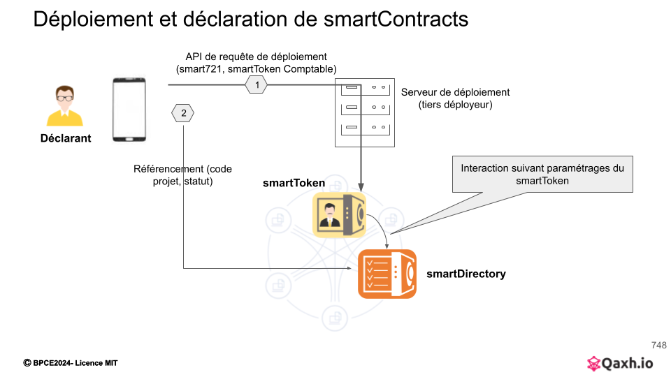

De façon synthétique, ce second composant consiste en :

* un serveur comprenant un noeud de la blockchain et une liste de smartContracts réutilisables en provenance d'une bibliothèque interne,
* des API exposées par ce même serveur et permettant de demander le déploiement des smartContracts de la bibliothèque avec des paramétrages propres en fonction de leur type.

Le protocole d'échange avec ce composant est découpé en deux interactions :

**1. La demande de déploiement proprement dite par l'application cliente :**
* exécution du déploiement sur la blockchain,
* et, en retour d'API, la transaction de déploiement.

**2. La validation du déploiement par l\'application cliente et référencement** (le serveur a-t-il bien déployé ce qui a été
demandé!) :
* Vérification du minage effectif du déploiement.
* Vérification de la prise en compte des paramètres du smartContract.
* Une transaction de modification (validation) vers le smartContract.

Cette mise en séquence est nécessaire car le déploiement se fait par un tiers (le serveur) et donc le consentement de 
l'administrateur doit être enregistré. De plus, cette séquence permet de ne pas utiliser pour la validation les mêmes 
clés que celles du serveur, car autant le déploiement doit se faire par EOA, autant il peut être pratique, pour le 
compte de l\'application client, de pouvoir choisir de passer par un compte abstrait (account abstraction) au lieu d'une
EOA.

Une telle architecture est compatible avec un administrateur humain voulant valider tous les déploiements, par analogie 
à un système de contrôle de type "4 yeux".

----------------------------------------------------------------

Avantages et points de vigilance de la solution
-----------------------------------------------

### Les avantages

L'avantage d'une telle architecture réside dans :

1.  une banalisation des déploiements et de leur référencement par l'utilisation d'API,
2.  une capacité d'insérer un déploiement et une référencement dans un processus métier,
3.  une capacité des smartContracts de processus de vérifier un groupe d'utilisateurs (représentés par des adresses) sans en connaître a priori la liste,
4.  une facilité de déploiement des account abstraction smartContracts ce qui permet un enrôlement automatique d'un utilisateur.

### Les points de vigilance

L'utilisation d'un smartDirectory implique cependant des points de vigilance complémentaires :

* **Assurer un niveau de sécurité et de résilience** du système d'autorisation et de vérification des informations enregistrées.

  * L'adresse du déclarant est importante mais bien moindre que celle de l'administrateur. La validité et la permanence de l'adresse de l'administrateur est essentielle et notre réponse passe par l'utilisation d'un wallet hybride décrit plus loin (hors périmètre de cette proposition). Ce wallet hybride peut être personnel ou d'entreprise. De la même manière, un déclarant peut mettre en œuvre un wallet hydride.
  * L'autre point réside dans la capacité de l'administrateur à enregistrer de nouveaux "déclarants" et de les désactiver le cas
      échéant.


* **Considérer l'utilisation d'un système de stockage décentralisé** au cas où il serait nécessaire de stocker des données plus importantes.

  * Le smartDirectory ne gère que des adresses et, de manière limitée, des URI comme point d'entrée sur le Web2.
  * En cas de nécessité de réaliser un écosystème plus large, il est possible de coupler un smartToken de type ERC721 qui va lister des fichiers identifiés en tant que NFT et gérer les autorisations d'accès vers le stockage :
    * Les fichiers sont potentiellement sur IPFS mais de manière plus pragmatique dans un monde professionnel, sur un "conservateur de fichiers", c'est-à-dire un serveur de fichiers qui ne délivre des fichiers qu'en fonction des autorisations lues sur le NFT associé.
    * De plus, l'authentification des requêtes vers le conservateur de fichiers se fait au travers du wallet hybride pour plus de sécurité
        ainsi le conservateur de fichiers opère sans nécessité de lui adjoindre des fonctions d'administration.
    

* Architecture et fonctionnement dans un **écosystème multichain** :
  * A ce stade de la proposition, la gestion multichain se fait manuellement par l'administrateur au travers de la création de plusieurs smartDirectory.
  * Évolution future : une deuxième étape pourrait aborder la faisabilité d'un smartToken d'une chaîne pour lire un smartDirectory d'une autre chaîne. L'ajout d'un paramètre "chainID" en plus de "contractVersion" et de "contractType" serait un minimum. L'utilisation des informations "on chain" par des smartcontracts nécessiterait une passerelle inter-chain.


* Évaluer l\'architecture de la solution pour un système de **blockchains permissionnées** (Consortium).
  * La proposition s'accorde bien sur une architecture permissionnée car, même dans un cadre de consortium, il est nécessaire de permettre à ses membres d'exposer l\'état de leur smartcontracts (actif, inactif, version ...). L'utilisation des informations du smartDirectory par les smartcontracts permet de restreindre les accès à un sous-ensemble des membres.


* Utilisation éventuelle d'un système d'autorisation multipartite (DAO, Multisig).
  * Ceci est possible avec un wallet hydride. Nous pensons qu'il reste préférable que les fonctions du système d'autorisation multipartite restent externes et non intégrées au smartDirectory.

------------------------------------------------------------------------

Les objectifs et ressources du projet
-------------------------------------

### Objectifs

1.  La réalisation en solidity du smartDirectory et son déploiement sur une blockchain de test, par exemple polygon AMOY.
2.  La réalisation d'une APP sur Android à des fins d'UI de démonstration pour écrire ou consulter les informations 
contenues dans un smart directory. Cette application a permis d'effectuer les actions et contrôles du plan de test.
3.  Réalisation d\'une application web d'affichage du contenu d'un smartDirectory, liste des registrants, liste des 
références, historique des statuts.
4.  La mise en place d'un serveur de déploiement avec 3 types de smartContracts (smartDirectory, ERC20, ERC721) en 
déploiement par API.

**Synthèse des fonctionnalités proposées :**

| Fonctionnalité                                                     | Description                                                                                                                                                                                                                                                                                                                                                                                                                  |
|--------------------------------------------------------------------|------------------------------------------------------------------------------------------------------------------------------------------------------------------------------------------------------------------------------------------------------------------------------------------------------------------------------------------------------------------------------------------------------------------------------|
| Identification et catalogage des smartContracts\*                  | En utilisant l'adresse du déclarant et le code projet il est possible de créer différents écosystèmes d'adresses.                                                                                                                                                                                                                                                                                                            |
| Création d'une base de données consultable\*                       | Le smartContract “smartDirectory” enregistre les adresses des smartContracts et un code projet ainsi que l’adresse déclarante.<br/>Le smartDirectory expose des “getters” permettant la lecture directe de chaque smartContract déclaré ou bien des listes.                                                                                                                                                                  |
| Développement d'une interface utilisateur- déclarant\*             | L'interface déclarant permet :<br/>- de choisir le type de smartContract à déployer,<br/>- de choisir les paramètres par défaut pour chaque type,<br/>- de remplacer les paramètres par défaut lors de la demande de création d’un smartContract,<br/>- de valider par transaction blockchain toute création de smartContract,<br/>- de lister les smartContracts déclarés, c’est-à-dire enregistrés dans le smartDirectory. | 
| Développement d\'une interface  utilisateur- superviseur\*         | Cette interface superviseur permet :<br/>- de filtrer la liste des smartContracts déclarés par des libellés (projectID),<br/>- de filtrer cette liste par version,<br/>- de filtrer cette liste par adresse de déclarant,<br/>- d'exporter la liste des adresses ainsi sélectionnées.                                                                                                                                        |
| Intégration de la vérification  des versions et des mises à jour\* | Chaque smartContract intègre un numéro de version à l’origine. Ce numéro d’origine ne peut être modifié mais l’ajout de status horodatés et historisés permet les mises à jour le cas échéant.                                                                                                                                                                                                                               |
\*_fonctionnalité identifiée dans le cahier des charges_


Potentiellement on pourrait réaliser un EIP (Ethereum Improvement Proposal) qui propose une approche standard sur :

* les interactions nécessaire au déploiement et à la déclaration d'un smartContract (API et protocole),
* l'accès au smartDirectory,
* le paramétrage générique minimal que tout smartContract doit mettre en oeuvre pour être déclarés et être vérifiable 
par d'autres smartContracts,
* des exemples.

### Ressources

Ce projet tire parti de fonctionnalités déjà développées par l'équipe de R&D blockchain du Groupe BPCE et qui seront 
adaptées pour le projet par cette même équipe. Cette équipe existe depuis début 2018 et possède tous les éléments et 
outils de développement sur des blockchains EVM, en particulier, un serveur avec des API et un noeud d'accès sur 
plusieurs blockchains de test : Polygon-AMOY, ZAMADEV, EVM-XRPL.

Différents tests et proofs of concept, comprenant des applications sous Android, ont été réalisés avec des concepts 
similaires ce qui permettra de tenir les délais en incorporant des fonctions en partie déjà existantes. En particulier, 
un smartContract (le schemeDirectory) est utilisé pour la structure de confiance des smartWallets d'identité du projet 
Qaxh.io. Ce smartContract offre un service analogue mais dans un contexte privatif et avec des éléments de sécurité 
spécifiques.

Quatre personnes de l'équipe R&D blockchain vont participer au projet regroupant les expertises nécessaires : Solidity 
sur EVM, outils de développement, API python, node Ethereum, fonctionnel et interface smartphone.

|                 |                                                                                                                                                                                                                                                                                                            |
|-----------------|------------------------------------------------------------------------------------------------------------------------------------------------------------------------------------------------------------------------------------------------------------------------------------------------------------|
|José LUU         | Tech lead du projet Qaxh.io depuis 2017.<br/>Co-auteur de l’article "Blockchain and the nature of money" dans "Banque et stratégie" September 2016<br/>https://papers.ssrn.com/sol3/papers.cfm?abstract_id=2939042.<br/>Précédemment responsable du logiciel de valorisation des dérivés actions à Natixis.|
|Hamza MEKHANEG   | Elève Ingénieur Alternant en dernière année de Mastère de l’Ingénierie de la Blockchain de l’Ecole Supérieure de Génie Informatique.<br/>Lauréat de plusieurs Hackathon (Hackathon Hackin’dau,  Hackathon HEC x Tezos, Hackathon ETH Global Istanbul).                                                     |
|Cyril VIGNET     | Ingénieur, animateur de la coordination blockchain du Groupe BPCE depuis 2015.<br/>Co-leader du projet de R&D Qaxh.io visant à concilier utilisateur de banque de détail et blockchain publique.<br/>Co-auteur de 10 brevets dans le domaine de la blockchain.<br/>Design et interface utilisateur.        |
|Vincent GRIFFAULT| Directeur de projets Transformation Digitale & Data @Caisse d’Epargne Rhône Alpes.<br/>Certificate of Advanced Studies Blockchain & DLT@University of Geneva.<br/>Contributeur du projet de R&D Qaxh.io.                                                                                                   |

------------------------------------------------------------------------

Fonctionnement détaillé du smartDirectory
-----------------------------------------

Le SmartDirectory est un smart contract (SmartDirectory.sol) associé à une bibliothèque solidity (SmartDirectoryLib.sol). 
Ces 2 éléments permettent la gestion d'un répertoire décentralisé composé de **références** (adresses de smartContracts) et 
de **leurs émetteurs (registrants)**. Ce répertoire peut être déployé, activé, configuré et administré par des adresses 
spécifiques appelées "**parents**".

L\'objectif principal est de :

* **Structurer et suivre des références** associées à des projets spécifiques.
* **Gérer les statuts des références** pour suivre leurs évolutions dans le temps.
* **Administrer des participants**, en leur permettant d\'ajouter des références ou non, en fonction du mode sélectionné au 
moment du déploiement du SmartDirectory.

Deux modes de gestion sont disponibles pour les administrateurs du SmartDirectory :

1. **_parentsAuthorized_** (ou gestion administrée) :
   - **Contrôle strict** : seules les adresses pré-enregistrées par les "parents" (administrateurs) peuvent ajouter des références.
   - **Processus d'inscription manuel** : les administrateurs doivent valider et ajouter les utilisateurs au répertoire.

2. selfDeclaration (ou gestion ouverte) :
   - **Liberté d'inscriptio**n : n'importe quelle adresse peut s'auto-enregistrer et ajouter des références.
   - **Inscription automatique** : si une adresse non connue tente d'ajouter une référence, elle est automatiquement enregistrée comme participant.

Ces deux modes permettent d\'adapter le smart contract aux besoins spécifiques :
* **Contrôle strict** pour des fournisseurs de services et applications devant être vérifiées au préalable.
* **Ouverture totale** pour des environnements collaboratifs.

C'est le paramètre **AdminCode**, non modifiable à posteriori, qui permet de choisir entre "_parentsAuthorized_" ou 
"_selfDeclaration_" lors du déploiement.

### Le mode administré (parentsAuthorized)

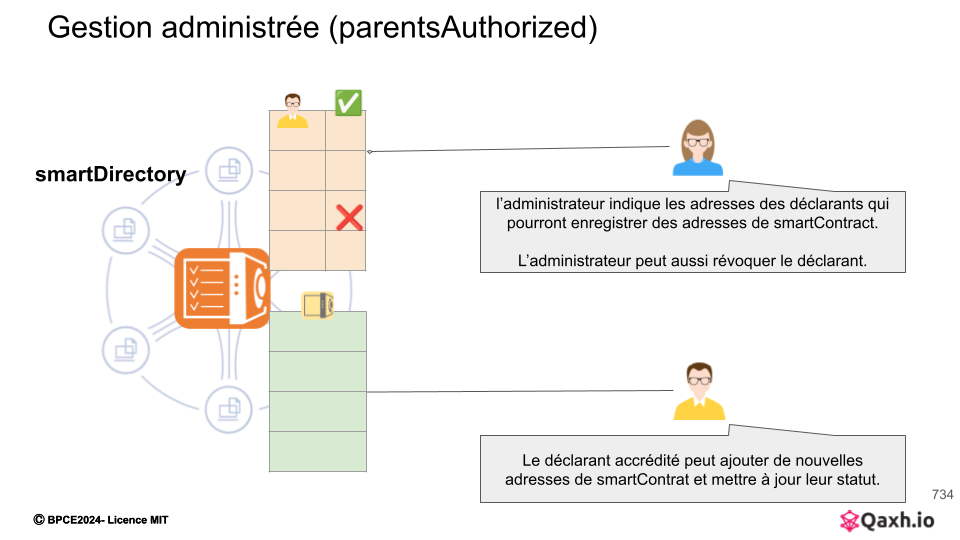

Dans le cas de la gestion administré, l'administrateur peut indiquer 2 adresses dites "**parent**".


### Le mode ouvert (selfDeclaration)

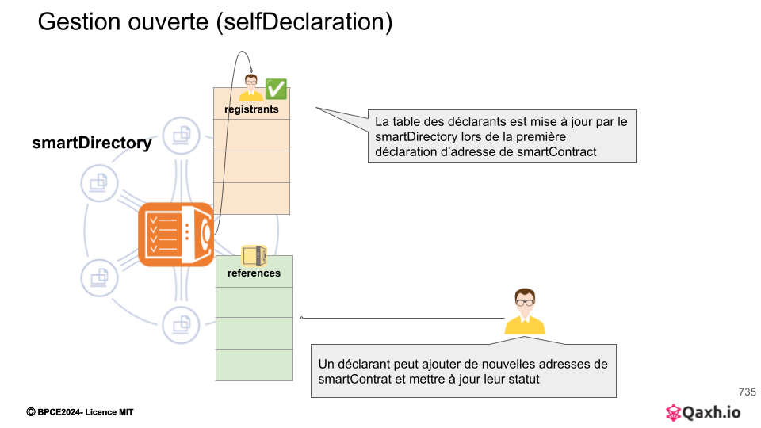

Les structures du smartDirectory
--------------------------------

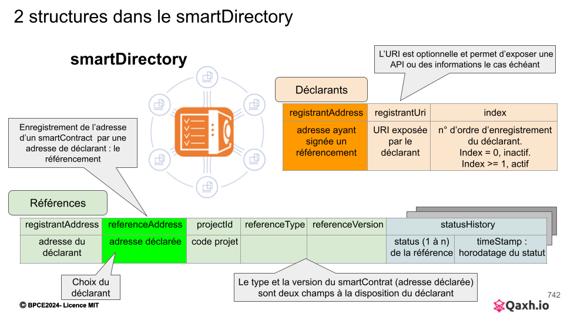


### La table des références (references Table)

Cette table contient toutes les adresses des smart contract (references):

**Reference**

* **_registrantAddress (msg.sender)_** : adresse du déclarant (EOA ou smartContract). Acteur externe identifié par son 
adresse et à même d'enregistrer des "references".
* **_referenceAddress (address)_** : adresse du smartContract déclaré (reference). Cette adresse peut aussi être une EOA.
* **_projectId (string)_** : une chaîne de caractères, identifiant du projet lié à la référence.
* **_referenceType (string)_** : type de la référence.
* **_referenceVersion (string)_** : version de la référence.
* **_statusHistory_** : historique des statuts associés à la référence. C'est une sous-liste (de premier index 1) qui 
peut être parcourue et comprenant

  **ReferenceStatus**

    * **_status (string)_** : état actuel de la référence. C'est une chaîne de caractères modifiable uniquement par le
      déclarant. La sémantique de ce statut est libre mais une signification explicite est conseillée(par ex: en
      production, en suspens, abandonné, etc...) ou une URId'explication.
    * **_timeStamp (uint256)_** : horodatage de l'écriture lors de la création ou du changement de statut.
    * **_latestStatusIndex (uint256)_** : index du dernier statut enregistré pour la référence. Cette variable n'est pas
      représentée sur le schéma ci-dessus (elle ne porte pas d'usage fonctionnel et est utilisée en interne par le contrat
      afin d'optimiser le code pour les fonctions "getters").

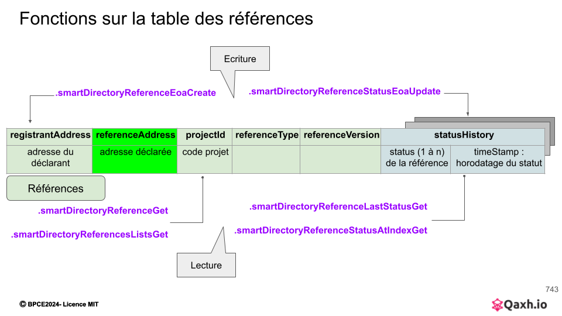


Note les méthodes comme ci-dessous en violet sont implémentées en java afin d'être utilisables dans l'application 
android voir "Environment de développement AppInventor" ci-après.

#### .smartDirectoryReferenceEoaCreate

**Sortie** : cette fonction permet la création d'un nouvel enregistrement et de son premier statut dans la table des 
références. La valeur de retour est un hash de la transaction pour vérifier le minage côté client.


**Paramètres en entrée :** smartDirectoryAddress, referenceAddress, projectId, referenceType, referenceVersion, status.

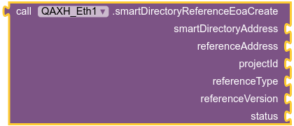

* L'adresse du déclarant n'est pas explicitement demandée dans les paramètres car c'est l'adresse qui signe la 
transaction de création.
* l'horodatage (timestamp) est mis automatiquement lors de la création de l'enregistrement.
* Le statut (status) est une chaîne de caractère libre qui peut si besoin être sous un "URI".

**Conditions d'exécution :**

Il existe 2 stratégies d'utilisation de cette fonction suivant le paramétrage du smartDirectory au moment de sa création :

Code Solidity:
```Solidity
enum AdminCode {
    parentsAuthorized,// Only addresses registered by parents can create references
    selfDeclaration // Any addresses can create references
}
```

* Si l' "AdminCode" du SmartDirectory est "parentsAuthorized" (0) :l'appelant doit être un participant valide. 
Pour ce faire, un enregistrement préalable du déclarant par l'une ou l'autre des adresses "parent" du smartDirectory a 
été effectué :
  * Si le déclarant n'est pas présent lorsqu'il déclare une référence -\> rejet de la référence (revert).
  * Si le déclarant est bien présent dans la table des déclarants lorsqu'il déclare une référence -\> ajout de la référence.
  * L'index du déclarant doit être \> à 0 dans la table "registrants".
      Si son index est = 0, cela signifie que les administrateurs du SmartDirectory (parentAddress1 ou 2) considèrent que le déclarant ne
      remplit plus les conditions requises pour lui permettre de référencer de nouvelles adresses de smartContracts.


* Si l' "AdminCode" du SmartDirectory est "selfDeclaration" (1) : enregistrement en simultané du déclarant et de la référence.
  * Si le déclarant n'est pas présent -\> l\'appelant s\'auto-enregistre dans la table des déclarants et ajout de la référence.
  * Si le déclarant est présent -\> ajout uniquement de la référence.


* Quel que soit l' "AdminCode", la référence n'est pas enregistrée si elle a été préalablement déclarée par le déclarant.


**Code :**

La fonction solidity appelée est "createReference" du smartContract
"SmartDirectory.sol". Le code java exécuté à partir de l'application
Android de démonstration est le suivant :

```Java
@SimpleFunction(description = "create a new smartContract reference in the SmartDirectory")
    public String smartDirectoryReferenceEoaCreate (String smartDirectoryAddress, String referenceAddress,
                                                    String projectId, String referenceType, String referenceVersion,
                                                    String status) {

        SmartDirectory folderContract = SmartDirectory.load(smartDirectoryAddress, web3, transactionManager,
                new CustomGasProvider());

        String tx_hash;
        try {
            tx_hash = doTransaction(
                    folderContract.createReference(
                            referenceAddress,
                            projectId,
                            referenceType,
                            referenceVersion,
                            status
                    ),
                    "createReference");
        } catch (Exception e) {
            String message = "Error smartDirectoryReferenceEoaCreate: " + e.getMessage();
            android.util.Log.d(LOG_TAG, message);
            tx_hash = message;
        }
        return tx_hash;
    }
```
--------- -------------------------------------------------------------------------------------
Exemple    TransactionHash: 0xc93b48f1d1be00c522e15f4536306cc06815351bddd5501fe24294d050bdfb6a
--------- -------------------------------------------------------------------------------------


#### .smartDirectoryReferenceStatusEoaUpdate

**Sortie** : cette fonction permet d'ajouter un nouveau statut et le timestamp associé dans la sous-liste statusHistory 
pour la referenceAddress passée en paramètre. Cette transaction d'update est signée par l'adresse du déclarant.

**Paramètres en entrée** : smartDirectoryAddress, referenceAddress, status.

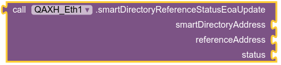

**Conditions d'exécution** :

* La référence doit préalablement exister dans la table "reference".
* Le déclarant doit exister dans la table "registrant" (mode "selfDeclaration") ou doit être valide (index \> à 0 en 
mode "parentsAuthorized").

**Code** :

La fonction solidity appelée est "updateReferenceStatus" du smartContract "SmartDirectory.sol". Le code java exécuté à 
partir de l'application Android de démonstration est le suivant :

```Java
    @SimpleFunction(description = "update status of a reference")
    public String smartDirectoryReferenceStatusEoaUpdate (String smartDirectoryAddress, String referenceAddress,
                                                          String status) {

        SmartDirectory folderContract = SmartDirectory.load(smartDirectoryAddress, web3, transactionManager,
                new CustomGasProvider());

        String tx_hash;
        try {
            tx_hash = doTransaction(
                    folderContract.updateReferenceStatus(referenceAddress, status),
                    "updateReferenceStatus");
        } catch (Exception e) {
            String message = "Error smartDirectoryReferenceStatusEoaUpdate: " + e.getMessage();
            android.util.Log.d(LOG_TAG, message);
            tx_hash = message;
        }
        return tx_hash;

    }
```

  --------- -------------------------------------------------------------------------------------
  Exemple   TransactionHash: 0xdb9688a22549627511cca990fe2ab0a35f53caa57dc6abf75042fa87e99ab0b6
  --------- -------------------------------------------------------------------------------------


#### .smartDirectoryReferenceGet

**Sortie** : cette fonction permet la lecture d'une "reference" en connaissant uniquement l'adresse du smartContract 
référencé (referenceAddress). C'est la fonction principale d'utilisation du smartDirectory. Elle retourne un dictionnaire contenant les informations complètes sur une référence.:

* registrantAddress : l'adresse du déclarant.
* registrantIndex : l'index du déclarant (si = à 0, le déclarant est désactivé et ne peut plus ajouter de référence).
* projectId : l'identification du projet auquel appartient le smartContract référencé.
* referenceType : le type de smartContract (champ libre à la main du déclarant).
* referenceVersion : la version du smartContract (champ libre à la main du déclarant).
* latestStatus : le dernier statut déclaré dans la sous-liste statusHistory.
* latestTimeStamp : le timestamp associé au dernier statut déclaré dans la sous-liste statusHistory.
* lastStatusIndex : l'index de ce dernier statut.

**Paramètres en entrée** : smartDirectoryAddress,referenceAddress


**Conditions d'exécution :**

* Si la référence n'existe pas, le dictionnaire renvoyé comporte un message d\'erreur.

| paramètres                                                                                                                         | retour valide                                                                                                                                                                                                                                                                                                                           | retour en erreur                                                                                                                           |
|------------------------------------------------------------------------------------------------------------------------------------|-----------------------------------------------------------------------------------------------------------------------------------------------------------------------------------------------------------------------------------------------------------------------------------------------------------------------------------------|--------------------------------------------------------------------------------------------------------------------------------------------|
| smartDirectoryAddress: 0x2ca24f2531309c8918961333720ee55ae5aa77ae<br/>referenceAddress: 0x52103544224a2ec194ca9673506b350d927057b4 | {"referenceAddress":"0x52103544224a2ec194ca9673506b350d927057b4",<br/>"lastTimestamp":"1734363453",<br/>"registrantIndex":"1",<br/>"referenceVersion":"EOA",<br/>"referenceType":"NA",<br/>"projectId":"MYSELF",<br/>"lastStatusIndex":"1",<br/>"registrantAddress":"0x52103544224a2ec194ca9673506b350d927057b4",<br/>"lastStatus":"NA"}                                        | {"Error smartDirectoryReferenceGet":<br/>"Contract Call has been reverted by the EVM with the reason: 'execution reverted: unknown reference'."} |


**Code :**

La fonction appelle les fonctions "getReference" et "getReferenceLastStatusIndex" du smartContract "SmartDirectory.sol".
Le code java exécuté à partir de l'application Android de démonstration est le suivant :

```Java
@SimpleFunction(description = "get smartContract reference details")
    public Object smartDirectoryReferenceGet(String smartDirectoryAddress, String referenceAddress) {

        SmartDirectory folderContract = SmartDirectory.load(smartDirectoryAddress, web3, transactionManager,
                new CustomGasProvider());

        Tuple8<String, BigInteger, String, String, String, String, String, BigInteger> reference;
        BigInteger lastStatusIndex;
        Map<String, String> result_dict = new HashMap<>();

        try {
            reference = folderContract.getReference(referenceAddress).send();
            lastStatusIndex = folderContract.getReferenceLastStatusIndex(referenceAddress).send();

            result_dict.put("registrantAddress", reference.component1());
            result_dict.put("registrantIndex", reference.component2().toString());
            result_dict.put("referenceAddress", reference.component3());
            result_dict.put("projectId", reference.component4());
            result_dict.put("referenceType", reference.component5());
            result_dict.put("referenceVersion", reference.component6());
            result_dict.put("lastStatus", reference.component7());
            result_dict.put("lastTimestamp", reference.component8().toString());
            result_dict.put("lastStatusIndex", lastStatusIndex.toString());
        } catch (Exception e) {
            result_dict.put("Error smartDirectoryReferenceGet", e.getMessage());
        }
        return result_dict;
    }
```


#### .smartDirectoryReferenceLastStatusGet

**Sortie :** La fonction renvoie le dernier statut ainsi que le dernier timestamp associé de l'adresse passée en 
paramètre. N.B. : la liste des statuts d'une référence est toujours initiée avec l'index 1 (l'index 0 nest pas utilisé).

**Paramètres en entrée :** smartDirectoryAddress, referenceAddress 


**Conditions d'exécution :**

* La "referenceAddress" doit préalablement exister dans la table "reference".

**Code :**

La fonction solidity appelée est "getReferenceStatus" du smartContract "SmartDirectory.sol". Le code java exécuté à 
partir de l'application Android de démonstration est le suivant :

```Java
    @SimpleFunction(description = "return reference status and timestamp at a given index")
    public Object smartDirectoryReferenceLastStatusGet(String smartDirectoryAddress,
                                                       String referenceAddress) {

        SmartDirectory folderContract = SmartDirectory.load(smartDirectoryAddress, web3, transactionManager,
                new CustomGasProvider());

        Tuple2<String, BigInteger> results_raw;
        Map<String, String> result_dict = new HashMap<>();

        try {
            results_raw = folderContract.getReferenceStatus(referenceAddress).send();
            result_dict.put("status",  results_raw.component1());
            result_dict.put("timestamp",   results_raw.component2().toString());
        } catch (Exception e) {
            result_dict.put("error",  "smartDirectoryReferenceLastStatusGet " + e.getMessage());
        }
        return result_dict;
    }
```


#### .smartDirectoryReferenceStatusAtIndexGet

**Sortie :** cette fonction permet la lecture d'un index spécifique de la sous-liste statusHistory. La fonction retourne
donc :

* le statut à l'index de la requête
* le timestamp à l'index de la requête

**Paramètres en entrée** : smartDirectoryAddress, referenceAddress, statusIndex 

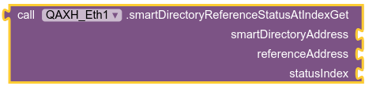

**Conditions d'exécution :**

* La "referenceAddress" doit préalablement exister dans la table "reference".
* Le "statusIndex" est strictement supérieur à 0.
* Le "statusIndex" doit être inférieur ou égal à la valeur de "latestStatusIndex" de la table "reference".

**Code :**

La fonction solidity appelée est "getReferenceStatusAtIndex" du smartContract "SmartDirectory.sol". Le code java exécuté
à partir de l'application Android de démonstration est le suivant :

```java
@SimpleFunction(description = "return reference status and timestamp at a given index")
public Object smartDirectoryReferenceStatusAtIndexGet(String smartDirectoryAddress, String referenceAddress,
                                                      int statusIndex) {

    SmartDirectory folderContract = SmartDirectory.load(smartDirectoryAddress, web3, transactionManager,
            new CustomGasProvider());

    Tuple2<String, BigInteger> results_raw;
    Map<String, String> result_dict = new HashMap<>();

    try {
        results_raw = folderContract.getReferenceStatusAtIndex(referenceAddress, BigInteger.valueOf(statusIndex)).send();
        result_dict.put("status",  results_raw.component1());
        result_dict.put("timestamp",   results_raw.component2().toString());
    } catch (Exception e) {
        result_dict.put("error",  "smartDirectoryReferenceStatusAtIndexGet " + e.getMessage());
    }
    return result_dict;
}
```

| paramètres                                                                                                                          | retour valide                                    |
|-------------------------------------------------------------------------------------------------------------------------------------|--------------------------------------------------|
| smartDirectoryAddress:0x2ca24f2531309c8918961333720ee55ae5aa77ae; <br/>referenceAddress: 0x52103544224a2ec194ca9673506b350d927057b4 | {\"status\":\"NA\",\"timestamp\":\"1734363453\"} |


#### .smartDirectoryReferencesListsGet

**Sortie :** cette fonction retourne deux listes synchronisée pour l'adresse de déclarant (registrantAddress) passée en 
paramètre :

* Liste 1 : liste des références enregistrées par l'adresse du déclarant.
* Liste 2 : liste des codes projets associés à chacune des références de la Liste 1.

Comme à chaque reference déclarée (referenceAddress) correspond un code projet (projectId), ces deux listes ont la même
taille et sont ordonnées pour que l'index de la liste des adresses déclarées corresponde à l'index du code projet.

**Paramètres en entrée :** smartDirectoryAddress, registrantAddress 


**Conditions d'exécution :**

* Le déclarant doit exister dans la table "registrant" (mode "selfDeclaration") ou doit être valide (index \> à 0 en 
mode "parentsAuthorized").
* N.B. : lors de la construction de la liste, la fonction intègre un contrôle de cohérence de l'appartenance de la 
"referenceAddress" à la "registrantAddress".

**Code :**

La fonction solidity appelée est "getReferencesLists" du smartContract "SmartDirectory.sol". Le code java exécuté à 
partir de l'application Android de démonstration est le suivant : 
```Java
    @SimpleFunction(description = "return a list of reference/projectId for a given registrant address")
    public Object smartDirectoryReferencesListsGet(String smartDirectoryAddress,
                                                   String registrantAddress) {

        SmartDirectory folderContract = SmartDirectory.load(smartDirectoryAddress, web3, transactionManager,
                new CustomGasProvider());

        Tuple2<List<String>, List<String>> results_raw;
        Map<String, List<String>> result_dict = new HashMap<String, List<String>>();

        try {
            results_raw = folderContract.getReferencesLists(registrantAddress).send();
            List<String> listAddresses = new ArrayList<String>();
            List<String> listProjetIDs = new ArrayList<String>();
            for (int i = 0; i< results_raw.component1().size(); i++){
                listAddresses.add(results_raw.component1().get(i));
                listProjetIDs.add(results_raw.component2().get(i));
            }
            result_dict.put("referenceList", listAddresses);
            result_dict.put("projectIdList", listProjetIDs);
        } catch (Exception e) {
            List<String> listErrors = new ArrayList<String>();
            listErrors.add("smartDirectoryReferencesListsGet: " + e.getMessage());
            result_dict.put("Error", listErrors);
        }
        return result_dict;
    }
```

------------------------------------------------------------------------


### La table des déclarants (registrants Table)

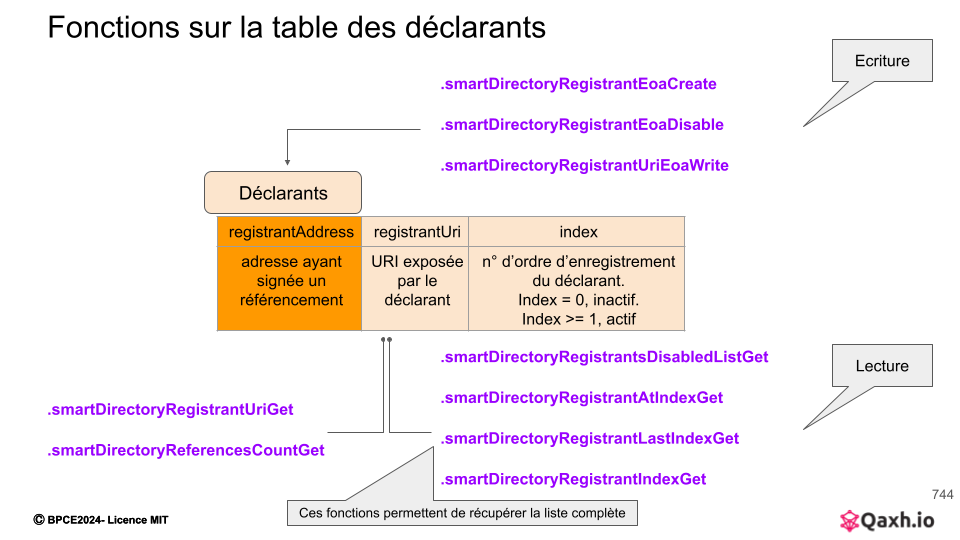

Une table des déclarants est créée et mise à jour soit explicitement pour chaque nouveau déclarant soit le cas échéant à
chaque nouvelle création de record dans la table des référencement, ceci en fonction de la stratégie d'utilisation : 
voir les conditions d'exécution de la fonction .smartDirectoryReferenceEoaCreate pour la présentation des deux modes 
de fonctionnement du SmartDirectory via l'utilisation de l'"**AdminCode**".

Cette table des déclarants est constituée de 3 éléments :

1.  l'adresse d'un déclarant,
2.  une chaîne de caractère à la disposition du déclarant afin d'y déposer une URI d'information. Cette chaîne de 
caractère est mise à jour dans un deuxième temps par le déclarant.
3.  Un index, représentant le n°d'ordre de l'enregistrement du déclarant dans la table.


------------------------------------------------------------------------


#### .smartDirectoryRegistrantEoaCreate

**Sortie** : cette fonction permet la création d'un nouveau déclarant par une adresse parent.

**Paramètres en entrée** : smartDirectoryAddress, registrantAddress 


**Conditions d'exécution :**

* Le SmartDirectory doit être dans un état activé (ActivationCode.active). Cela empêche des modifications si le
smartDirectory est déployé mais inactif.
* Cette fonction n'est disponible que dans le mode "parentsAuthorized" (AdminCode=0) : seuls les administrateurs 
(parentAddress1 ou 2) peuvent créer un registrant.
* L'adresse donnée (registrantAddress) ne doit pas déjà être enregistrée.

**Code :**

La fonction solidity appelée est "createRegistrant" du smartContract "SmartDirectory.sol". Le code java exécuté à partir
de l'application Android de démonstration est le suivant :
```Java
    @SimpleFunction(description = "create a registrant address in registrants data structure, only parents")
public String smartDirectoryRegistrantEoaCreate(String smartDirectoryAddress, String registrantAddress) {

    SmartDirectory folderContract = SmartDirectory.load(smartDirectoryAddress, web3, transactionManager,
            new CustomGasProvider());

    String tx_hash;
    try {
        tx_hash = doTransaction(
                folderContract.createRegistrant(registrantAddress),
                "createRegistrant");
    } catch (Exception e) {
        String message = "Error smartDirectoryRegistrantEoaCreate: " + e.getMessage();
        android.util.Log.d(LOG_TAG, message);
        tx_hash = message;
    }
    return tx_hash;

}
```

  --------- -------------------------------------------------------------------------------------
  exemple   TransactionHash: 0xffc632f9b47c2702c0ac566ba31869edeaaffdf566d3ed396256f313e2288bea
  --------- -------------------------------------------------------------------------------------


#### .smartDirectoryRegistrantEoaDisable

**Sortie :** cette fonction permet de désactiver un déclarant, charge au vérificateur de voir s'il continue de faire 
confiance aux références même si le déclarant n'est plus autorisé. La désactivation d'un déclarant se traduit par la 
mise à 0 de l'index associé à son adresse dans la table des déclarants (et non par l'effacement de son adresse dans la 
table) :

* Index = 0 =\> déclarant enregistré mais invalidé (ne peut plus créer de référence).
* Index \>= 1 =\> déclarant enregistré et validé (peut créer des références).

**Paramètres en entrée :** smartDirectoryAddress, registrantAddress 


**Conditions d'exécution :**

L'usage de cette fonction est conditionné :

* Le SmartDirectory doit être dans un état activé (ActivationCode.active).
* L'index de l'adresse donnée en paramètre est \> à 0 et inférieur à la valeur maximale des indices de la table 
"registrants" (check interne à la fonction).
* Cette fonction n'est disponible que dans le mode "parentAuthorized" (AdminCode=0) : seuls les administrateurs 
(parentAddress1 ou 2) peuvent l'utiliser et invalider un déclarant (registrant).

**Code :**

La fonction solidity appelée est "disableRegistrant" du smartContract "SmartDirectory.sol". Le code java exécuté à 
partir de l'application Android de démonstration est le suivant :
```Java
    @SimpleFunction(description = "del a registrant address in registrants data structure, only parents")
    public String smartDirectoryRegistrantEoaDisable(String smartDirectoryAddress, String registrantAddress) {

        SmartDirectory folderContract = SmartDirectory.load(smartDirectoryAddress, web3, transactionManager,
                new CustomGasProvider());

        String tx_hash;
        try {
            tx_hash = doTransaction(
                    folderContract.disableRegistrant(registrantAddress),
                    "delRegistrant");
        } catch (Exception e) {
            String message = "Error smartDirectoryRegistrantEoaDel: " + e.getMessage();
            android.util.Log.d(LOG_TAG, message);
            tx_hash = message;
        }
        return tx_hash;

    }
```


#### .smartDirectoryRegistrantUriEoaWrite

**Sortie :** une fois son adresse enregistrée dans la table "registrants", le déclarant peut directement créer/modifier 
son Uri. Cette fonction permet la mise à jour de la chaîne de caractère de la table des déclarants. La transaction doit 
être signée par le déclarant (msg.sender = registrantAddress, donc l'adresse du déclarant n'est pas dans les paramètres).

**Paramètres en entrée :** smartDirectoryAddress, registrantUri 
 


**Conditions d'exécution :**

* Le déclarant doit exister dans la table "registrant" (mode "selfDeclaration") ou doit être valide (index \> à 0 en 
mode "parentsAuthorized").

**Code :**

La fonction solidity appelée est "updateRegistrantUri" du smartContract "SmartDirectory.sol". Le code java exécuté à 
partir de l'application Android de démonstration est le suivant :
```Java
    @SimpleFunction(description = "update uri associated to a registrant")
    public String smartDirectoryRegistrantUriEoaWrite(String smartDirectoryAddress, String registrantUri) {

        SmartDirectory folderContract = SmartDirectory.load(smartDirectoryAddress, web3, transactionManager,
                new CustomGasProvider());

        String tx_hash;
        try {
            tx_hash = doTransaction(
                    folderContract.updateRegistrantUri(registrantUri),
                    "updateRegistrantUri");
        } catch (Exception e) {
            String message = "Error smartDirectoryRegistrantUriEoaWrite: " + e.getMessage();
            android.util.Log.d(LOG_TAG, message);
            tx_hash = message;
        }
        return tx_hash;

    }
```


#### .smartDirectoryRegistrantUriGet

**Sortie :** cette fonction renvoie l'URI de la table des déclarants pour l'adresse du déclarant donnée en paramètre. 
La fonction retourne un dictionnaire :

* dictionnaire vide si l'adresse demandée n'existe pas dans la table.
* {"registrant\_uri" : "\<string\>"} si l'adresse est dans la table.

**Paramètres en entrée** : smartDirectoryAddress,registrantAddress


**Conditions d'exécution :**

* Le déclarant doit exister dans la table "registrant" (mode "selfDeclaration") ou doit être valide (index \> à 0 en 
mode "parentsAuthorized").

**Code :**

La fonction solidity appelée est "getRegistrantUri" du smartContract "SmartDirectory.sol". Le code java exécuté à partir
de l'application Android de démonstration est le suivant :
```Java
    public String smartDirectoryRegistrantUriGet(String smartDirectoryAddress, String registrantAddress) {
        SmartDirectory folderContract = SmartDirectory.load(smartDirectoryAddress, web3, transactionManager,
                new CustomGasProvider());

        String result;
        try {
            result = folderContract.getRegistrantUri(registrantAddress).send();
        } catch (Exception e) {
            String message = "Error smartDirectoryRegistrantUriGet: " + e.getMessage();
            android.util.Log.e(LOG_TAG, message);
            result = message;
        }
        return result;

    }
```


#### .smartDirectoryRegistrantsDisabledListGet

**Sortie** : cette fonction retourne la liste des déclarants ayant le statut "désactivé".Quand le SmartDirectory est 
déployé en mode administré ("parentsAuthorized"), un déclarant considéré comme n'étant plus légitime pour enregistrer 
de nouvelles références peut-être désactivé (disabled). Cf. "smartDirectoryRegistrantEoaDisable" ci-dessus.

**Paramètres en entrée** : smartDirectoryAddress 


**Conditions d'exécution** :

* La liste retournée n'est peuplée que des adresses de déclarant dont l'index est égal à 0 dans la table "registrants".

**Code** :

La fonction solidity appelée est "getDisabledRegistrants" du smartContract "SmartDirectory.sol". Le code java exécuté à 
partir de l'application Android de démonstration est le suivant :
```Java
    @SimpleFunction(description = "get disabledRegistrants list")
    public Object smartDirectoryRegistrantsDisabledListGet(String smartDirectoryAddress) {

        SmartDirectory folderContract = SmartDirectory.load(smartDirectoryAddress, web3, transactionManager,
                new CustomGasProvider());

        Map<String, List<String>> result_dict = new HashMap<>();

        try {
            List<String> results_raw = folderContract.getDisabledRegistrants().send();
            result_dict.put("disabledRegistrants", results_raw);
        } catch (Exception e) {
            List<String> listErrors = new ArrayList<>();
            listErrors.add("smartDirectoryRegistrantsDisabledListGet: " + e.getMessage());
            result_dict.put("Error", listErrors);
        }
        return result_dict;
    }
```


#### .smartDirectoryRegistrantLastIndexGet

**Sortie** : cette fonction permet de connaître le dernier index de la liste des déclarants.

**Paramètres en entrée** : smartDirectoryAddress 


**Conditions d'exécution** :
* Néant.

**Code** :

La fonction solidity appelée est "getRegistrantLastIndex" du smartContract "SmartDirectory.sol". Le code java exécuté à 
partir de l'application Android de démonstration est le suivant :
```Java
    @SimpleFunction(description = "get the last index of the declared registrants")
    public int smartDirectoryRegistrantLastIndexGet(String smartDirectoryAddress) {
        SmartDirectory folderContract = SmartDirectory.load(smartDirectoryAddress, web3, transactionManager,
                new CustomGasProvider());

        BigInteger result;
        int resultInt;

        try {
            result = folderContract.getRegistrantLastIndex().send();
            resultInt = result.intValue();
        } catch (Exception e) {
            android.util.Log.e(LOG_TAG, "Exception: smartDirectoryRegistrantLastIndexGet" + e.getMessage());
            resultInt = -1;
        }
        return resultInt;
    }
```


#### .smartDirectoryRegistrantAtIndexGet

**Sortie** : cette fonction permet de lire l'adresse d'un déclarant en donnant son index.

**Paramètres en entrée** : smartDirectoryAddress, index


**Conditions d'exécution** :

* L'index passé en paramètre doit être supérieur à 0 et inférieur ou égal à la valeur maximale des indices de la table 
"registrants".

**Code** :

La fonction solidity appelée est "getRegistrantAtIndex" du smartContract "SmartDirectory.sol". Le code java exécuté à 
partir de l'application Android de démonstration est le suivant :
```Java
    @SimpleFunction(description = "return registrant address and uri at the given index")
    public Object smartDirectoryRegistrantAtIndexGet(String smartDirectoryAddress, String index) {

        SmartDirectory folderContract = SmartDirectory.load(smartDirectoryAddress, web3, transactionManager,
                new CustomGasProvider());

        Tuple2<String, String> results_raw;

        Map<String, String> result_dict = new HashMap<String, String>();

        try {
            results_raw = folderContract.getRegistrantAtIndex(new BigInteger(index)).send();
            result_dict.put("registrantAddress", results_raw.component1());
            result_dict.put("registrant_uri", results_raw.component2());
        } catch (Exception e) {
            String message = "Error smartDirectoryRegistrantAtIndexGet: " + e.getMessage();
            android.util.Log.e(LOG_TAG, message);
            result_dict.put("error", message);
        }
        return result_dict;
    }
```
| Exemple                                                                                                                                                                                                                           |
|-----------------------------------------------------------------------------------------------------------------------------------------------------------------------------------------------------------------------------------|
| smartDirectoryAddress:0x623a73351159c85cdb0d3cd8665ab13dbf42f4f2<br/>lastRegistrantIndex: 1<br/>registrantAtIndex : {\"registrant\_uri\":\"👋 hello world\",\"registrantAddress\":\"0x52103544224a2ec194ca9673506b350d927057b4\"} |


#### .smartDirectoryRegistrantIndexGet

**Sortie :** cette fonction permet de connaître l'index d'un déclarant. Elle permet aussi de savoir si une adresse 
valide (autorisée à créer des références) :

* Si le retour de cette fonction est "0" (zéro), l'adresse du déclarant n'est pas valide.

**Paramètres en entrée :**smartDirectoryAddress, registrantAddress 


**Conditions d'exécution :**

* Néant.

**Code :**

La fonction solidity appelée est "getRegistrantIndex" du smartContract "SmartDirectory.sol". Le code java exécuté à 
partir de l'application Android de démonstration est le suivant :
```Java
    @SimpleFunction(description = "return registrant index given its address")
    public int smartDirectoryRegistrantIndexGet(String smartDirectoryAddress, String registrantAddress) {
        SmartDirectory folderContract = SmartDirectory.load(smartDirectoryAddress, web3, transactionManager,
                                                            new CustomGasProvider());
        int result=0;
        try {
            result = folderContract.getRegistrantIndex(registrantAddress).send().intValue();
            return result;
        } catch (Exception e) {
            String message = "Error smartDirectoryRegistrantIndexGet: " + e.getMessage();
            android.util.Log.e(LOG_TAG, message);
        }
        return result;
    }
```


#### .smartDirectoryReferencesCountGet

**Sortie** : Cette fonction retourne la taille de la liste des références
d'un déclarant sous la forme d'un nombre entier. Cela peut être utile
pour modifier l'UX de l'utilisateur en cas de taille importante.

Paramètres en entrée : smartDirectoryAddress, registrantAddress, 


**Conditions d'exécution** :

* Néant.

**Code** :

La fonction solidity appelée est "getRegistrantReferencesCount" du smartContract "SmartDirectory.sol". Le code java 
exécuté à partir de l'application Android de démonstration est le suivant :
```Java
    @SimpleFunction(description = "get registrant references count")
    public int smartDirectoryReferencesCountGet(String smartDirectoryAddress, String registrantAddress) {

        SmartDirectory folderContract = SmartDirectory.load(smartDirectoryAddress, web3, transactionManager,
                new CustomGasProvider());

        BigInteger result;
        int resultInt;

        try {
            result = folderContract.getRegistrantReferencesCount(registrantAddress).send();
            resultInt = result.intValue();
        } catch (Exception e) {
            String message = "Error smartDirectoryReferencesCountGet: " + e.getMessage();
            android.util.Log.d(LOG_TAG, message);
            resultInt = -1;
        }
        return resultInt;

    }
```


------------------------------------------------------------------------

Création du smartDirectory
----------------------------

Le smartDirectory est un smartContract qui met en œuvre des paramètres afin d'en faciliter la gestion dans les cas 
d'usage privatifs.

### Les variables d'en-tête

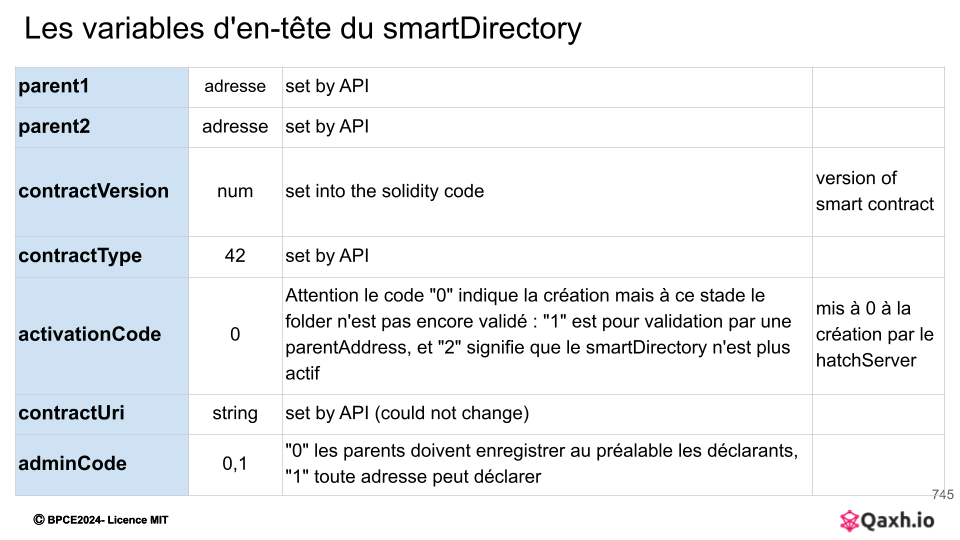

Ces variables ainsi que les structures de stockage des déclarants ("registrants") et des adresses référencées 
("references") sont contenues dans une structure globale "SmartDirectoryStorage" portée par la librairie 
"SmartDirectoryLib.sol" :

* parents[2\] : liste des 2 adresses des créateurs du SmartDirectory (adresses demandées lors de la requête API de création du contrat). Elles doivent être différentes et ne pas être \`address(0)\`.
* contractVersion : version du contrat pour identifier les évolutions sûrement nécessaire
* contractType : numéro arbitrairement fixé à "42" permettant de reconnaître en "machine readable" que c'est un smartDirectory.
* activationCode : statut d\'activation du contrat mis à jour exclusivement par une des deux adresses Parent pour indiquer la validité du smartDirectory :
  * "0" ou "pending" =\> en cours de création, pas encore validé. Aucune référencement ne peut être enregistré.
  * "1" ou "active" =\> smartDirectory validé par une parentAddress : toutes les fonctions sont accessibles.
  * "2" ou "closed" =\> smartDirectory clôturé par une parentAddress :aucune transaction ni mise à jour ne peut se faire.
* contractUri : URI décrivant le contrat. String non modifiable à l'usage du créateur du smartDirectory
* adminCode : entier inscrit au déploiement et non modifiable :
  * "0" ou "parentsAuthorized" : seuls les participants enregistrés au préalable par les parents peuvent créer des références.
  * "1" ou "selfDeclaration" : toute adresse peut être déclarant (accès d'autodéclaration) et ajouter des références.
* registrants : Liste des adresses des déclarants.
* registrantData : Mapping des données des déclarants.
* referenceData : Mapping des données des références enregistrées par les déclarants.

|                        |                                                                                                                                                                                                                                                                                                                                                                                                                                                                                                                                                                                                                                                                                                                                                                                                                                                                  |
|------------------------|------------------------------------------------------------------------------------------------------------------------------------------------------------------------------------------------------------------------------------------------------------------------------------------------------------------------------------------------------------------------------------------------------------------------------------------------------------------------------------------------------------------------------------------------------------------------------------------------------------------------------------------------------------------------------------------------------------------------------------------------------------------------------------------------------------------------------------------------------------------|
| exemple (requête POST) | [https://smart-directory.qaxh.io/smart-directory/smartdirectorycreate?parent\_address1=0x52103544224a2ec194ca9673506b350D927057B4&parent\_address2=0x88D65F27e269b4f92CE2Ccf124eAE8648635a67A&contract\_uri=https%3A%2F%2Fdocs.google.com%2Fdocument%2Fd%2F1wPvoksIErxEp9Ai45ywboklO2XrIgIba7xQ4swaSMWc%2Fedit%3Fusp%3Dsharing&admin\_code=0&chain\_id=80002](https://www.google.com/url?q=https://smart-directory.qaxh.io/smart-directory/smartdirectorycreate?parent_address1%3D0x52103544224a2ec194ca9673506b350D927057B4%26parent_address2%3D0x88D65F27e269b4f92CE2Ccf124eAE8648635a67A%26contract_uri%3Dhttps%253A%252F%252Fdocs.google.com%252Fdocument%252Fd%252F1wPvoksIErxEp9Ai45ywboklO2XrIgIba7xQ4swaSMWc%252Fedit%253Fusp%253Dsharing%26admin_code%3D0%26chain_id%3D80002&sa=D&source=editors&ust=1735324824838691&usg=AOvVaw05qH-8sB_kH_ELbDHqfd0g) |
| exemple (retour API)   | responsecode: 200 responsecontent: { \"name\": \"\", \"return\_code\": 200, \"tx\_hash\": \"0x599fd3dbac60c4cef66e8626e61bfe0d902ca6d8eef103a4340216b6e8bdb6c6\" }                                                                                                                                                                                                                                                                                                                                                                                                                                                                                                                                                                                                                                                                                               |


### Les fonctions de management du SmartDirectory

Ces fonctions permettent d\'accéder aux paramètres du SmartDirectory :


#### .smartDirectoryActivationCodeEoaUpdate

**Sortie** : cette fonction permet de changer le statut d'activation ("activationCode") du smartDirectory de "0" vers 
"1" (ou "2" le cas échéant). Le retour de cette fonction est le tx\_Hash de la transaction de mise à jour.

**Paramètres en entrée** : smartDirectoryAddress,activationCode

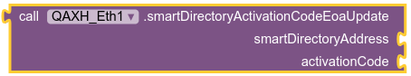

**Conditions d'exécution** :

* L'appelant doit être un parent.
* Le statut de déploiement du SmartDirectory doit être "pending" ou "active".

**Code** :

La fonction solidity appelée est "setSmartDirectoryActivationCode" du smartContract "SmartDirectory.sol". Le code java 
exécuté à partir de l'application Android de démonstration est le suivant :
```Java
    @SimpleFunction(description = "Set smartDirectory's activation code")
    public String smartDirectoryActivationCodeEoaUpdate(String smartDirectoryAddress, int activationCode) {
        SmartDirectory folderContract = SmartDirectory.load(smartDirectoryAddress, web3, transactionManager,
                new CustomGasProvider());

        return doTransaction(
                folderContract.setActivationCode(BigInteger.valueOf(activationCode)),
                "setSmartDirectoryActivationCode");

    }
```

|         |                                                                                     |
|---------|-------------------------------------------------------------------------------------|
| exemple | TransactionHash: 0x2f407597f3004c89dcac5a643ac51980eb6301aa5f9bb10d6a4ac0c99f919ae6 |


#### .smartDirectoryHeadersGet

**Sortie** : cette fonction permet la lecture des variables contenues dans les en-têtes sous forme d'un dictionnaire.

**Paramètres en entrée** : smartDirectoryAddress


**Conditions d'exécution** :

* Néant.

**Code** :

Le dictionnaire retourné est constitué de plusieurs appels aux getters solidity dédiés à chaque variables du 
SmartDirectory :

* smartDirectoryGetParent1 appelle la fonction solidity "getParent1".
* smartDirectoryGetParent2 appelle la fonction solidity "getParent2".
* smartDirectoryGetContractVersion appelle la fonction solidity "getContractVersion".
* smartDirectoryGetContractType appelle la fonction solidity "getContractType".
* smartDirectoryGetActivationCode appelle la fonction solidity "getActivationCode".
* smartDirectoryGetContractUri appelle la fonction solidity "getContractUri".
* smartDirectoryGetAdminCode appelle la fonction solidity "getAdminCode".

L'ensemble des retours de ces appels est ensuite assemblé dans le dictionnaire "smartDirectoryCreateVariablesMap" 
lui-même invoqué par la fonction "smartDirectoryHeadersGet". Le code java exécuté à partir de l'application Android de 
démonstration est le suivant :
```Java
    @SimpleFunction(description = "get information about the deployed SmartDirectory")
    private Map<String, String> smartDirectoryCreateVariablesMap(String smartDirectoryAddress) {
        final Map<String, String> variables = new HashMap<String, String>() {
            {
                put("parentAddress1", smartDirectoryGetParent1(smartDirectoryAddress));
                put("parentAddress2", smartDirectoryGetParent2(smartDirectoryAddress));
                put("contractVersion", smartDirectoryGetContractVersion(smartDirectoryAddress));
                put("contractType", smartDirectoryGetContractType(smartDirectoryAddress));
                put("activationCode", smartDirectoryGetActivationCode(smartDirectoryAddress));
                put("contractUri", smartDirectoryGetContractUri(smartDirectoryAddress));
                put("adminCode", smartDirectoryGetAdminCode(smartDirectoryAddress));
            };
        };

        return variables;
    }

    @SimpleFunction(description = "get all variables of smartDirectory in a dictionary")
    public Object smartDirectoryHeadersGet(String smartDirectoryAddress) {

    return smartDirectoryCreateVariablesMap(smartDirectoryAddress);
    }

```
|           |                                                                                                                                                                                                                                                                                                                                                                                                                                                                                                                      |
|-----------|----------------------------------------------------------------------------------------------------------------------------------------------------------------------------------------------------------------------------------------------------------------------------------------------------------------------------------------------------------------------------------------------------------------------------------------------------------------------------------------------------------------------|
| paramètre | smartDirectoryAddress:0x599dc64f7a235663e50f5a002df393cb2672c702                                                                                                                                                                                                                                                                                                                                                                                                                                                     |
| exemple   | {\"parentAddress2\":\"0x88d65f27e269b4f92ce2ccf124eae8648635a67a\",\"contractUri\":\"https:\\/\\/[docs.google.com](https://www.google.com/url?q=http://docs.google.com&sa=D&source=editors&ust=1735324824851686&usg=AOvVaw0DZyUqYQwEm9W5wleDCM1Q)\\/document\\/d\\/1wPvoksIErxEp9Ai45ywboklO2XrIgIba7xQ4swaSMWc\\/edit?usp=sharing\",\"contractType\":\"42\",\"adminCode\":\"0\",\"activationCode\":\"1\",\"parentAddress1\":\"0x52103544224a2ec194ca9673506b350d927057b4\",\"contractVersion\":\"SD 1.09SDL 1.17\"} |


------------------------------------------------------------------------


### API de création d'un smartDirectory

Cet API permet à un utilisateur de créer un smartDirectory facilement sans connaissance préalable de la Blockchain :

**/smart-directory/smartdirectorycreate?**

|                                                                                                                                           |
|-------------------------------------------------------------------------------------------------------------------------------------------|
| API endpoint: POST /smart-directory/smartdirectorycreate<br/>This API is used to create a smartDirectory smartContract<br/>Request Body : |
| {<br/>  “parent_address1”: “0x..”,<br/> “parent_address2”: “0x..”,<br/> “contract_uri”: “uri attaché au smartContract”,<br/>  “admin_code”: “ 1”,<br/> “chain_id”: “80002”,<br/>}|

|         |                                                                                                                                                                                                    |
|---------|----------------------------------------------------------------------------------------------------------------------------------------------------------------------------------------------------|
| Exemple | "https://smart-directory.qaxh.io/smart-directory/smartdirectorycreate?parent_address1=<parentAddress1”& parent_address2=<parentAddress2>&contract_uri=<string>&mint_code=<1, 2>&chain_Id=<chainId> |


Les autres paramètres nécessaires sont gérés directement par le serveur de déploiement :

* contractVersion : version du code du contrat pour identifier les évolutions,
* contractType : numéro arbitrairement fixé à "42" permettant de reconnaître en "machine readable" que c'est un smartDirectory,
* activationCode : mis à "0" ou "pending" lors du déploiement.


|                                                                                                                                                              |
|--------------------------------------------------------------------------------------------------------------------------------------------------------------|
| Responses:<br/>Success - 200:                                                                                                                                |
| {<br/>  “return_code”: 200, <br/> “tx_hash”: “0x….”, <br/>}                                                                                                  |
| Failures: {<br/>-   500 -\> mauvais argument dans le call d'API <br/>-   400 -\> timer déclenché pendant la déploiement<br/>-   405 -\> déploiement en échec |


La réponse du serveur peut se faire avant la confirmation du déploiement. C'est à l'entité qui a invoqué l'API de 
s'assurer que le déploiement est correct en analysant le statut de la transaction de déploiement (tx\_hash) dans 
la réponse.


### Gestion du smartDirectory pour finaliser le déploiement

| Etapes                                                                                                                     | Commentaires                                                                   |
|----------------------------------------------------------------------------------------------------------------------------|--------------------------------------------------------------------------------|
| Sur l'APP, remplir les différents éléments de l'API.                                                                       |                                                                                |
| Valider l'envoi de l'API.                                                                                                  |                                                                                |
| En retour de l'API, attendre la fin du minage du smartDirectory.                                                           | Sur la base du tx\_hash reçu                                                   |
| Enregistrer l'adresse du smartDirectory dans la base de données de l'APP.                                                  |                                                                                |
| Après fin du déploiement, lire les éléments du smartDirectory et les comparer aux éléments demandés et aux spécifications. | .smartDirectoryHeadersGet (smartDirectoryAddress)                              |
| Si tous les contrôles sont ok, proposer à l'utilisateur de valider l'activation du smartDirectory (écran APP).             |                                                                                |
| Signer la transaction d'activation du smartDirectory (nécessite du GAS).                                                   | .smartDirectoryActivationCodeEoaUpdate (smartDirectoryAddress, activationCode) |
| Récupérer le tx\_hash de la transaction précédente et attendre le minage.                                                  |                                                                                |
| Si le minage est ok, informer l\'utilisateur de l'APP, sinon  l'entrée dans la base de données peut être effacée.          |                                                                                |


### Diffusion et import de l'adresse du smartDirectory

| Etapes                                                                                                                                                 | Commentaires    |
|--------------------------------------------------------------------------------------------------------------------------------------------------------|-----------------|
| Sur l'APP, proposer la liste des smartDirectory.                                                                                                       |                 |                                                                                                        
| Après sélection par l'utilisateur afficher l'adresse du smartDirectory dont un QRcode ethereum:\<adresse du smartDirectory\>@\<chain\_Id\> (EIP 681).  |                 |  
| L'écran de détail doit prévoir un bouton "partager" qui permet l'envoi du QRcode et de l'adresse en chaîne de caractères vers un email, whatsapp,\...  |                 |

| Etapes                                                                                                                                                     | Commentaires |
|------------------------------------------------------------------------------------------------------------------------------------------------------------|--------------|                                                                                                                                
| Sur l'APP, proposer une fonction d'import de smartDirectory qui renvoie sur l'appareil photo.                                                              |              |                                                               
| Analyser le QRcode et le retenir s'il est de la forme "ethereum:\<adresse du smartDirectory\>\[@\<chain\_Id\>\] (EIP 681) \[entre crochet est optionnel\]. |              |  
| En cas de syntaxe correcte, lire l'adresse pour voir si elle correspond à un smartDirectory et proposer sa sauvegarde à l\'utilisateur.                    |              |

------------------------------------------------------------------------

SmartTokens
-----------

Le concept du smartToken introduit la possibilité pour un token (fongible, non fongible, autres) de consulter un 
smartDirectory afin de filtrer les adresses qui lui envoient des ordres (transfert, mintage, ...) pour ne retenir que 
celles qui sont dans ce smartDirectory.

Cette approche permet de réaliser des écosystèmes avec des contrôles d\'accès. En effet, il suffit de positionner dans 
le smartContract une adresse de smartDirectory et éventuellement une adresse de déclarant pour réaliser ce filtrage. 
Si la liste des références évolue, le smartToken n'a pas besoin d'être modifié.

Il revient au développeur du smartToken de positionner les filtres liés aux exigences du métier.

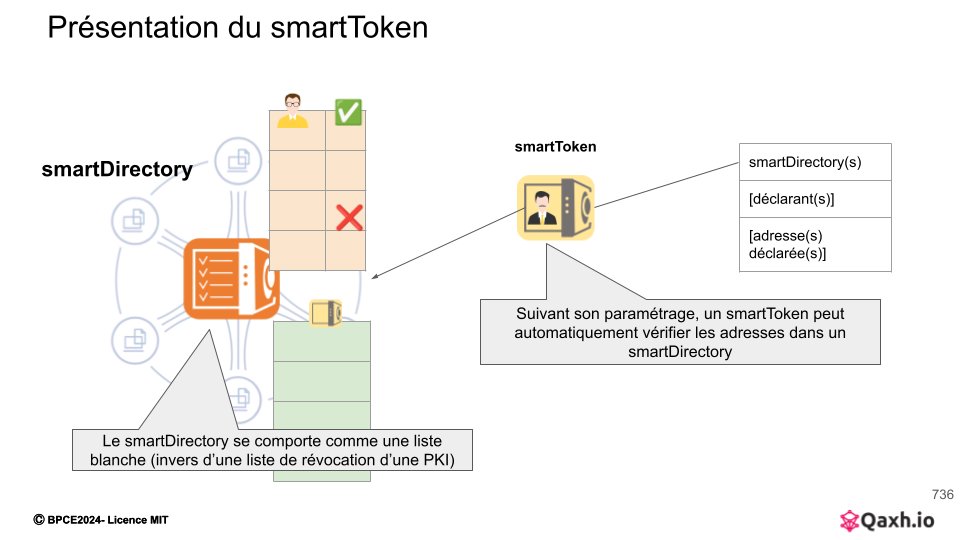

------------------------------------------------------------------------


### Cas d'utilisation

* Token fongible multi-émetteurs :
  * Chaque émetteur (un établissement de monnaie électronique, dans le monde régulé) sera autorisé en tant que référence dans un smartDirectory par une autorité de régulation, Cette dernière faisant office d'administrateur du smartDirectory.
  * Le token fongible n\'autorise le mintage de nouveau tokens par un émetteur que s'il est dans la liste, charge à l'émetteur de respecter le cantonnement des fonds associé à ce mintage.

* Token fongible à KYC préalable :
  * En complément (ou indépendamment), il est possible d'avoir un second smartDirectory dans lequel les émetteurs sont des déclarants, à charge pour ces derniers d'indiquer les adresses (références) des utilisateurs qu'ils ont au préalable vérifiées en termes de KYC.
  * Le token fongible peut ainsi être programmé pour n'autoriser les transferts qu'entre adresses déclarées sur ce second smartDirectory. Les adresses des utilisateurs finaux étant positionnées par un déclarant, la responsabilité du KYC peut être facilement établie.

* Notifications des AirDrops :
  * Un smartDirectory est utilisé pour référencer des tokens qui offrent des airDrops.
  * L'app de l'utilisateur va lire ce smartDirectory, filtrer les références qui concernent des tokens fongibles et lire sa balance dans chacun des tokens.

------------------------------------------------------------------------


### Paramétrage des smartTokens

Tout contrat et donc tout token peut être enregistré comme référence dans le smartDirectory, un smartToken est un token 
(fongible ou non) qui peut utiliser les méthodes liées au smartDirectory.

Pour cela, en plus de son fonctionnement de token, il comprend 2 variables spécifiques à sa création lui permettant la 
consultation lors de son usage :

* **smart\_directory**
  * =0x000000 ...
  * = adresse de smartDirectory valide \<smartDirectoryAddress\>
* **registrant\_address**
  * =0x000000...
  * =\<registrant\_address\> , adresse EOA ou smartContract

Le smartToken paramétré avec un smartDirectory et un déclarant doit refuser une transaction si le déclarant a été 
invalidé par l'administrateur du smartDirectory.

En complément, nous avons ajouté deux autres variables qui facilitent la vérification de la cohérence entre un 
smartDirectory et le smartToken si ce dernier est aussi référencé :

* smartTokenType
* smartTokenVersion

Enfin, pour faciliter le déploiement par un serveur (et non pas directement par l'utilisateur), il est utile d'ajouter 
deux autres variables :

* parentAddress1
* parentAddress2

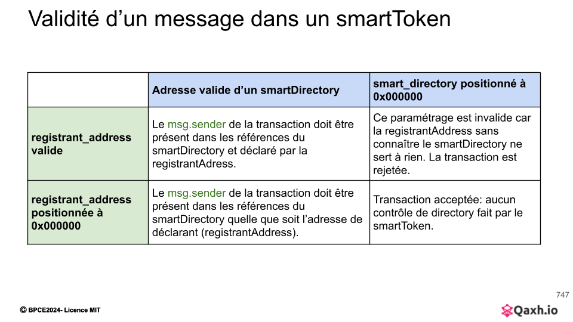


### Déploiement pour tokenisation

Nous allons limiter la tokenisation au déploiement de tokens non
fongibles et de token comptable (token fongible pouvant être négatif).


### API de création d'un smartToken non fongible (smart721)

Le déploiement d'un smartToken non fongible se fait avec le recours à une API : **/smart721create?**

Cette API permet de faire créer au serveur un NFT ayant des fonctions ERC721 et aussi les fonctions lui permettant de 
consulter le smartDirectory :

* VARIABLE permettant la vérification de la chaîne utilisée par le serveur
  * **chain\_id**=number of the chain to be used for deployment

* VARIABLES du nftFolder (collection de NFT)
  * **max\_token** : maximum number of tokens in this nftFolder. if equal to "0", the number of tokens has no limit
  * **parent\_address1** : (habituellement nommée "owner")
    * 0X..., first parentAddress of the folder. usually the EOA address of the user requesting the creation of the smart721
    * or 0x0000000 .
  * **parent\_address2** : ("owner" secondaire)
    * 0X..., second parentAddress of the folder. usually the EOA of another device the user requesting the creation of the smart721
    * or 0x0000000....folder

* VARIABLES liées au smartToken
  * **smart\_directory**
  * **registrant\_address**

* VARIABLES de l'ERC721 de base
  * name : nom de l'ERC721
  * symbol : symbole de l'ERC721
  * base\_uri: URI du serveur de téléchargement des fichiers (mis dans base\_uri de l'ERC721)

|         |                                                                                                                                                                                                                                                                                                                                                                                                                                                                                                                                                                                                                                                                                                                                                                                                                                                                                                                                                                                                                   |
|---------|-------------------------------------------------------------------------------------------------------------------------------------------------------------------------------------------------------------------------------------------------------------------------------------------------------------------------------------------------------------------------------------------------------------------------------------------------------------------------------------------------------------------------------------------------------------------------------------------------------------------------------------------------------------------------------------------------------------------------------------------------------------------------------------------------------------------------------------------------------------------------------------------------------------------------------------------------------------------------------------------------------------------|
| exemple | [https://smart-directory.qaxh.io/smart-director/smart721create?parent\_address1=0x52103544224a2ec194ca9673506b350D927057B4&parent\_address2=0x52103544224a2ec194ca9673506b350D927057B4&max\_token=0&smart\_directory=0x314b51087ce7d40182cf0671264fff0395a25a96&registrant\_address=0x88D65F27e269b4f92CE2Ccf124eAE8648635a67A&name=test\_TK721\_556&symbol=TKT721\_556&base\_uri=https://nftserver.qaxh.io/nftindexread&chain\_id=80002](https://www.google.com/url?q=https://smart-directory.qaxh.io/smart-directorydirectory721create?parent_address1%3D0x52103544224a2ec194ca9673506b350D927057B4%26parent_address2%3D0x52103544224a2ec194ca9673506b350D927057B4%26max_token%3D0%26smart_directory%3D0x0000000000000000000000000000000000000000%26registrant_address%3D0x0000000000000000000000000000000000000000%26name%3DDIR721_556%26symbol%3DDIR721_556%26base_uri%3Dhttps://nftserver.qaxh.io/nftindexread%26chain_id%3D80002&sa=D&source=editors&ust=1735324824875430&usg=AOvVaw3eMLHDYo4jqJmw9dFmXvSz) |


en POST.

    {

    "return\_code": 200,

    "tx\_hash": "0x....",

    }

* Return code
  * 200 Success


### Lecture des variables du smart721

Chaque variable peut être lue directement en AI2 (App Inventor 2) :

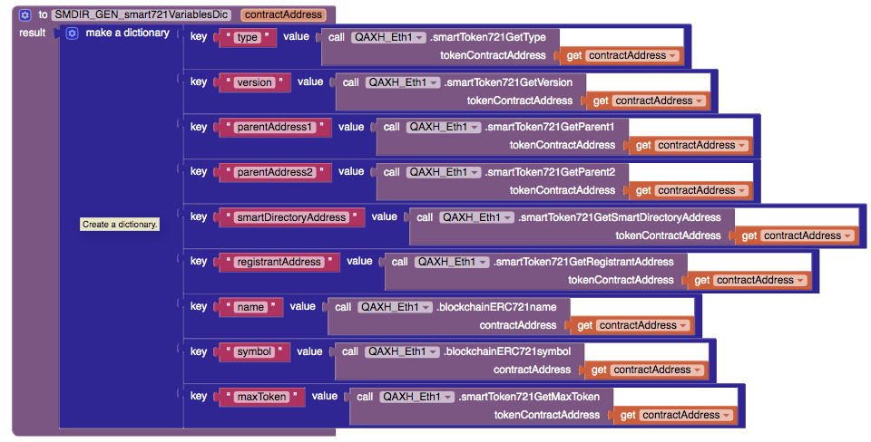

Les fonctions listées ci-dessous permettent de retourner les différentes variables du token :


#### .smartToken721GetType

**Sortie** : cette fonction retourne le type de token. En l\'occurrence : "Smart721".

**Paramètres en entrée** : tokenContractAddress


**Conditions d'exécution** :

* Néant.

**Code** :

La fonction solidity appelée est "get\_type" du smartContract "SmartToken721.sol". Le code java exécuté à partir de 
l'application Android de démonstration est le suivant :
```Java
    @SimpleFunction(description = "Type is defined within the token source code")
    public String smartToken721GetType(String tokenContractAddress) {
        SmartToken721 smartToken721 = SmartToken721.load(tokenContractAddress, web3, transactionManager,
            new CustomGasProvider());
        String type;
        try {
            type = smartToken721.get_type().send();
        } catch (Exception e) {
            String message = "Error when calling get_type (SmartToken721): " + e.getMessage();
            android.util.Log.d(LOG_TAG,  message);
            return message;
        }
        return  type;
    }
```


#### .smartToken721GetParent1

**Sortie** : cette fonction retourne l'adresse "parent1" de l\'émetteur du smartToken721.

**Paramètres en entrée** : tokenContractAddress 


**Conditions d'exécution** :

* Néant.

**Code** :

La fonction solidity appelée est "get\_parent1" du smartContract "SmartToken721.sol". Le code java exécuté à partir de 
l'application Android de démonstration est le suivant :
```Java
    @SimpleFunction(description = "Parent1 is defined at token creation and allows some alterations")
    public String smartToken721GetParent1(String tokenContractAddress) {
        SmartToken721 smartToken721 = SmartToken721.load(tokenContractAddress, web3, transactionManager,
            new CustomGasProvider());
        String parent;
        try {
            parent = smartToken721.get_parent1().send();
        } catch (Exception e) {
            String message = "Error when calling get_parent1 (SmartToken721): " + e.getMessage();
            android.util.Log.d(LOG_TAG,  message);
            return message;
        }
        return  parent;
    }
```

#### .smartToken721GetParent2

**Sortie** : cette fonction retourne l'adresse "parent2" de l'émetteur du smartToken721.

**Paramètres en entrée** : tokenContractAddress 


**Conditions d'exécution** :

* Néant.

**Code** :

La fonction solidity appelée est "get\_parent2" du smartContract "SmartToken721.sol". Le code java exécuté à partir de 
l'application Android de démonstration est le suivant :

```Java
    @SimpleFunction(description = "Parent2 is defined at token creation and allows some alterations")
public String smartToken721GetParent2(String tokenContractAddress) {
    SmartToken721 smartToken721 = SmartToken721.load(tokenContractAddress, web3, transactionManager,
            new CustomGasProvider());
    String parent;
    try {
        parent = smartToken721.get_parent2().send();
    } catch (Exception e) {
        String message = "Error when calling get_parent2 (SmartToken721): " + e.getMessage();
        android.util.Log.d(LOG_TAG,  message);
        return message;
    }
    return  parent;
}
```


#### .smartToken721GetMaxToken

**Sortie** : cette fonction retourne le nombre maximum de token qu'il est possible de minter.

**Paramètres en entrée** : tokenContractAddress 


**Conditions d'exécution** :

* Néant.

**Code** :

La fonction solidity appelée est "get\_max\_token" du smartContract "SmartToken721.sol". Le code java exécuté à partir 
de l'application Android de démonstration est le suivant :
```Java
    @SimpleFunction(description = "Returns the max_token value.")
    public String smartToken721GetMaxToken(String tokenContractAddress) {
        SmartToken721 smartToken721 = SmartToken721.load(tokenContractAddress, web3, transactionManager,
            new CustomGasProvider());
        BigInteger maxToken;
        try {
            maxToken = smartToken721.get_max_token().send();
        } catch (Exception e) {
            String message = "Error when calling get_max_token (SmartToken721): " + e.getMessage();
            android.util.Log.d(LOG_TAG,  message);
            return message;
        }
        //TODO convert
        return  maxToken.toString();
    }
```


#### .smartToken721GetSmartDirectoryAddress

**Sortie** : cette fonction retourne retourne l'adresse du SmartDirectory associée au token.

**Paramètres en entrée** : tokenContractAddress 


**Conditions d'exécution** :

* Néant.

**Code** :

La fonction solidity appelée est "get\_smart\_directory" du smartContract "SmartToken721.sol". Le code java exécuté à 
partir de l'application Android de démonstration est le suivant :
```Java
    @SimpleFunction(description = "Returns the smart directory address.")
    public String smartToken721GetSmartDirectoryAddress(String tokenContractAddress) {
        SmartToken721 smartToken721 = SmartToken721.load(tokenContractAddress, web3, transactionManager,
            new CustomGasProvider());
        String smartDirectoryAddress;
        try {
            smartDirectoryAddress = smartToken721.get_smart_directory().send();
        } catch (Exception e) {
            String message = "Error when calling get_smart_directory (SmartToken721): " + e.getMessage();
            android.util.Log.d(LOG_TAG,  message);
            return message;
        }
        return  smartDirectoryAddress;
    }
```


#### .smartToken721GetRegistrantAddress

**Sortie** : cette fonction retourne la "registrantAddress" associée au token.

**Paramètres en entrée** : tokenContractAddress, 


**Conditions d'exécution** :

* Néant.

**Code** :

La fonction solidity appelée est "get\_registrant\_address" du smartContract "SmartToken721.sol". Le code java exécuté 
à partir de l'application Android de démonstration est le suivant :
```Java
    @SimpleFunction(description = "Returns the registrant address.")
    public String smartToken721GetRegistrantAddress(String tokenContractAddress) {
        SmartToken721 smartToken721 = SmartToken721.load(tokenContractAddress, web3, transactionManager,
            new CustomGasProvider());
        String registrantAddress;
        try {
            registrantAddress = smartToken721.get_registrant_address().send();
        } catch (Exception e) {
            String message = "Error when calling get_registrant_address (SmartToken721): " + e.getMessage();
            android.util.Log.d(LOG_TAG,  message);
            return message;
        }
        return  registrantAddress;
    }
```


#### .blockchainERC721name

**Sortie** : cette fonction retourne le nom du token SmartToken721 via la fonction générique de la norme ERC721.

**Paramètres en entrée** : contractAddress, 


**Conditions d'exécution** :

* Néant.

**Code** :

Le code java exécuté à partir de l'application Android de démonstration est le suivant :
```Java
    @SimpleFunction(description = "Get contract name")
    public String blockchainERC721name(String contractAddress) {
        final Function function = new Function("name",
                Collections.<Type>emptyList(),
                Arrays.<TypeReference<?>>asList(new TypeReference<Utf8String>() {
                }));
        List<Utf8String> lst = callViewFunction(contractAddress, function);
        return lst.get(0).getValue().toString();
    }
```


#### .blockchainERC721symbol

**Sortie** : cette fonction retourne le symbole du token SmartToken721 via la fonction générique de la norme ERC721.

**Paramètres en entrée** : contractAddress, 


**Conditions d'exécution** :

* Néant.

**Code** :

Le code java exécuté à partir de l'application Android de démonstration est le suivant :
```Java
    @SimpleFunction(description = "Get contract symbol")
    public String blockchainERC721symbol(String contractAddress) {
        final Function function = new Function("symbol",
                Collections.<Type>emptyList(),
                Arrays.<TypeReference<?>>asList(new TypeReference<Utf8String>() {
                }));
        List<Utf8String> lst = callViewFunction(contractAddress, function);
        return lst.get(0).getValue().toString();
    }
```


#### .smartToken721GetVersion

**Sortie** : cette fonction retourne la version du smart contract du SmartToken721.

**Paramètres en entrée** : tokenContractAddress,


**Conditions d'exécution** :

* Néant.

**Code** :

La fonction solidity appelée est "version" du smartContract "SmartToken721.sol". Le code java exécuté à partir de 
l'application Android de démonstration est le suivant :
```Java
    @SimpleFunction(description = "Version refers to the token source code")
    public String smartToken721GetVersion(String tokenContractAddress) {
        SmartToken721 smartToken721 = SmartToken721.load(tokenContractAddress, web3, transactionManager,
            new CustomGasProvider());
        String version;
        try {
            version = smartToken721.version().send();
        } catch (Exception e) {
            String message = "Error when calling version (SmartToken721): " + e.getMessage();
            android.util.Log.d(LOG_TAG,  message);
            return message;
        }
        return  version;
    }
```

------------------------------------------------------------------------


### API de création d'un token fongible (smartErc20A)

Le déploiement d'un smartToken fongible se fait avec le recours à une API : **/smartErc20Acreate?**

Cette API doit comprendre tous les paramètres pour créer le smartContract :

* API
  * chain\_id=80002

* VARIABLES
  * chain\_id:
  * decimals : number of decimals of the token: 18 decimales pour l'instant
  * name : name of the token (ERC20 full name)
  * symbol (symbol of the ERC20)
  * parent\_address1 : 0X..., EOA ou adresse de l'utilisateur demandant la création du smartAToken
  * parent\_address2 : EOA ou adresse d'un autre appareil de l'utilisateur demandant la création du smartAToken
  * smart\_directory
  * registrant\_address
  * token\_type : ERC20A ou ERC20

Le serveur va créer un Accounting Token :

* avec (name, symbol, decimals) fonction des paramètres donnés par l'API
* avec parent\_address1, parent\_address2, smart\_directory et registrant\_address fonction des paramètres données par l'API

Les décimales ne sont qu'une donnée permettant de définir la virgule dans les tokens.

**{"return\_code": 200,  "tx\_hash": "0x...."}**

* Return code
  * 200 Success

Pour le type et la version, appeler get\_type() ou version() après création du token.

Exemple, en utilisant le serveur de test :

|                                   |                                                                                                                                                                                                                                                                                                                                                                          |
|-----------------------------------|--------------------------------------------------------------------------------------------------------------------------------------------------------------------------------------------------------------------------------------------------------------------------------------------------------------------------------------------------------------------------|
| exemple                           | /smart-directory/smartErc20Acreate?chain_id=80002&allow_non_zero_total_balance=True&parent_address1=0xe3f1413e071332840db2735f809cf3240c4a4255&parent_address2=0x8a5f2f59a281751965C90d3AEbB4Ba853e1E64bb&smart_directory=0x17da3871714bC7754fcA06002fF483Df63d8F9cc&registrant_address=0x88D65F27e269b4f92CE2Ccf124eAE8648635a67A&name=testERC20APython&symbol=ERC20ATP |


### Lecture des variables du smartERC20A

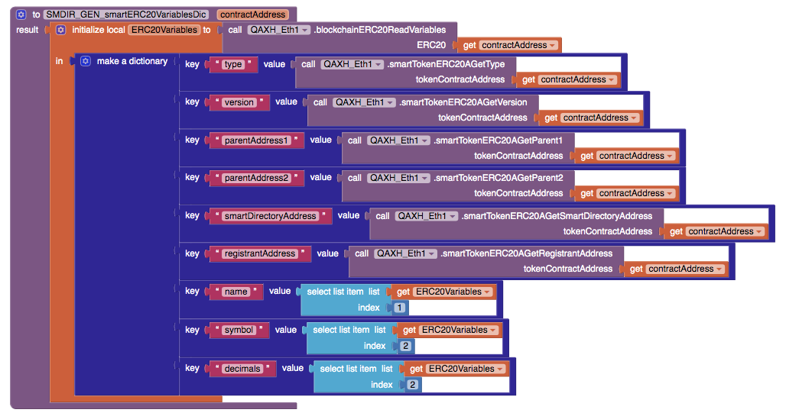

Les fonctions listées ci-dessous permettent de retourner les différentes variables du token :


#### .blockchainERC20ReadVariables

**Sortie** : cette fonction retourne le nom, le symbole et le nombre de décimales du token SmartTokenERC20A via les 
fonctions génériques "get\_name", "get\_symbol" et "get\_decimals" du standard ethereum ERC20.

**Paramètres en entrée** : ERC20


**Conditions d'exécution** :

* Néant.

**Code** :
Le code java exécuté à partir de l'application Android de démonstration est le suivant :
```Java
    @SimpleFunction(description = "Get Name, Symbol and decimal of an ERC20")
    public List<String> blockchainERC20ReadVariables(String ERC20) {

        List<String> result = new ArrayList<String>();

        Function get_name = new Function(
                "name",
                Collections.<Type>emptyList(),
                Collections.<TypeReference<?>>singletonList(new TypeReference<Utf8String>() {
                }));
        List<Utf8String> lst_n = callViewFunction(ERC20, get_name);
        result.add(lst_n.get(0).toString());

        Function get_symbol = new Function(
                "symbol",
                Collections.<Type>emptyList(),
                Collections.<TypeReference<?>>singletonList(new TypeReference<Utf8String>() {
                }));
        List<Utf8String> lst_s = callViewFunction(ERC20, get_symbol);
        result.add(lst_s.get(0).toString());

        Function get_decimals = new Function(
                "decimals",
                Collections.<Type>emptyList(),
                Collections.<TypeReference<?>>singletonList(new TypeReference<Uint256>() {
                }));
        List<Uint256> lst_d = callViewFunction(ERC20, get_decimals);
        result.add(lst_d.get(0).getValue().toString());

        return result;
    }
```


#### .smartTokenERC20AGetType

**Sortie** : cette fonction retourne le type de SmartTokenERC20A déployé. Le type peut avoir 2 valeurs :
* ERC20 : standard ethereum, balances à solde strictement positif.classique,
* ERC20A : token comptable défini sur la base d'un ERC20 mais pouvant avoir un solde négatif.

**Paramètres en entrée** : tokenContractAddress


**Conditions d'exécution** :

* Néant.

**Code** :

La fonction solidity appelée est "get\_type" du smartContract "SmartTokenERC20A.sol". Le code java exécuté à partir de 
l'application Android de démonstration est le suivant :
```Java
    @SimpleFunction(description = "tokenType is defined at deployment time")
    public String smartTokenERC20AGetType(String tokenContractAddress) {
        SmartTokenERC20A smartTokenERC20A = SmartTokenERC20A.load(tokenContractAddress, web3, transactionManager,
                new CustomGasProvider());
        String result;
        try {
            result = smartTokenERC20A.get_type().send();
        } catch (Exception e) {
            String message = "Error when calling get_type (SmartTokenERC20A): " + e.getMessage();
            android.util.Log.d(LOG_TAG,  message);
            result = message;
        }
        return  result;
    }
```


#### .smartTokenERC20AGetParent1

**Sortie** : cette fonction retourne la "parentAddresss" 1 de l'émetteur du smartTokenERC20A.

**Paramètres en entrée** : tokenContractAddress 


**Conditions d'exécution** :

* Néant.

**Code** :

La fonction solidity appelée est "get\_parent1" du smartContract "SmartTokenERC20A.sol". Le code java exécuté à partir 
de l'application Android de démonstration est le suivant :
```Java
    @SimpleFunction(description = "Parent1 is defined at token creation and allows some alterations")
    public String smartTokenERC20AGetParent1(String tokenContractAddress) {
        SmartTokenERC20A smartTokenERC20A = SmartTokenERC20A.load(tokenContractAddress, web3, transactionManager,
                new CustomGasProvider());
        String parent;
        try {
            parent = smartTokenERC20A.get_parent1().send();
        } catch (Exception e) {
            String message = "Error when calling get_parent1 (SmartTokenERC20A): " + e.getMessage();
            android.util.Log.d(LOG_TAG,  message);
            return message;
        }
        return  parent;
    }
```


#### .smartTokenERC20AGetParent2

**Sortie** : cette fonction retourne la "parentAddresss" 2 de l\'émetteur du smartTokenERC20A.

**Paramètres en entrée** : tokenContractAddress


**Conditions d'exécution** :

* Néant.

**Code** :

La fonction solidity appelée est "get\_parent2" du smartContract "SmartTokenERC20A.sol". Le code java exécuté à partir 
de l'application Android de démonstration est le suivant :
```Java
    @SimpleFunction(description = "Parent2 is defined at token creation and allows some alterations")
    public String smartTokenERC20AGetParent2(String tokenContractAddress) {
        SmartTokenERC20A smartTokenERC20A = SmartTokenERC20A.load(tokenContractAddress, web3, transactionManager,
                new CustomGasProvider());
        String parent;
        try {
            parent = smartTokenERC20A.get_parent2().send();
        } catch (Exception e) {
            String message = "Error when calling get_parent2 (SmartTokenERC20A): " + e.getMessage();
            android.util.Log.d(LOG_TAG,  message);
            return message;
        }
        return  parent;
    }
```


#### .smartTokenERC20AGetSmartDirectoryAddress

**Sortie** : cette fonction retourne retourne l'adresse du SmartDirectory associée au token.

**Paramètres en entrée** : tokenContractAddress 


**Conditions d'exécution** :

* Néant.

**Code** :

La fonction solidity appelée est "get\_smart\_directory" du smartContract "SmartTokenERC20A.sol" :
```Java
    @SimpleFunction(description = "SmartDirectoryAddress is defined at creation time")
    public String smartTokenERC20AGetSmartDirectoryAddress(String tokenContractAddress) {
        SmartTokenERC20A smartTokenERC20A = SmartTokenERC20A.load(tokenContractAddress, web3, transactionManager,
                new CustomGasProvider());
        String address;
        try {
            address = smartTokenERC20A.get_smart_directory().send();
        } catch (Exception e) {
            String message = "Error when calling get_smart_directory (SmartTokenERC20A): " + e.getMessage();
            android.util.Log.d(LOG_TAG,  message);
            return message;
        }
        return address;
    }
```


#### .smartTokenERC20AGetRegistrantAddress

**Sortie** : cette fonction retourne la "registrantAddress" associée au token.

**Paramètres en entrée** : tokenContractAddress 


**Conditions d'exécution** :

* Néant.

**Code** :

La fonction solidity appelée est "get\_registrant" du smartContract "SmartTokenERC20A.sol". Le code java exécuté à 
partir de l'application Android de démonstration est le suivant :
```Java
    @SimpleFunction(description = "RegistrantAddress is defined at token creation time")
    public String smartTokenERC20AGetRegistrantAddress(String tokenContractAddress) {
        SmartTokenERC20A smartTokenERC20A = SmartTokenERC20A.load(tokenContractAddress, web3, transactionManager,
                new CustomGasProvider());
        String address;
        try {
            address = smartTokenERC20A.get_registrant_address().send();
        } catch (Exception e) {
            String message = "Error when calling get_registrant_address (SmartTokenERC20A): " + e.getMessage();
            android.util.Log.d(LOG_TAG,  message);
            return message;
        }
        return address;
    }
```


#### .smartTokenERC20AGetVersion

**Sortie** : cette fonction retourne la version du smart contract du
SmartTokenERC20A.

**Paramètres en entrée** : tokenContractAddress


**Conditions d'exécution** :

* Néant.

**Code** :

La fonction solidity appelée est "version" du smartContract "SmartTokenERC20A.sol". Le code java exécuté à partir de 
l'application Android de démonstration est le suivant :
```Java
    public String smartTokenERC20AGetVersion(String tokenContractAddress) {
        SmartTokenERC20A smartTokenERC20A = SmartTokenERC20A.load(tokenContractAddress, web3, transactionManager,
                new CustomGasProvider());
        String version;
        try {
            version = smartTokenERC20A.version().send();
        } catch (Exception e) {
            String message = "Error when calling version (SmartTokenERC20A): " + e.getMessage();
            android.util.Log.d(LOG_TAG,  message);
            return message;
        }
        return  version;
    }
```


Plan de test
------------


### SmartDirectory administré


* **Créer un smartDirectory Administré**

  * En utilisant l'API sur le serveur de déploiement.

  * Vérifier que l'ensemble des paramètres demandés au serveur sont corrects dans le smartDirectory (utilisation des getters).

  * Activer le smartDirectory avec l'adresse parent1.

  * Vérifier l'impossibilité de déclarer une "reference" avec l'adresse parent1.

  * Vérifier l'impossibilité de déclarer une référence avec l'adresse parent2.

  * Vérifier l'impossibilité de déclarer une "reference" avec une EOA quelconque.

  * Vérifier l'impossibilité de modifier une string "registrantURI" avec une EOA.

  * Insérer l'adresse parent1 comme déclarant avec l'adresse parent2 comme signature (émetteur) de la transaction de demande.

  * lire la liste des déclarants (registrantsList) et vérifier que l'adresse parent1 est bien déclarée.

  * vérifier que l'adresse parent1 peut maintenant inscrire une regsitrantURI.

  * Insérer l'adresse parent2 comme déclarant avec parent2 comme signature.

  * Lire la liste des déclarants (registrantsList) et vérifier que les 2 adresses parent1 et parent2 sont bien déclarées.

  * Déclarer comme "référence" l'adresse parent2 avec parent1 (qui est toujours déclarant).

  * Lire la référence pour récupérer le statut et vérifier que le statut corresponde et que l'horodatage soit correct.

  * Écrire un nouveau statut avec "parent1" comme signature.

  * Relire la référence et la liste des statuts pour vérifier à nouveau les index et les horodatages.

  * Écrire une référence (parent1 ou une EOA) avec parent2.

  * lire la référence pour récupérer le statut et vérifier que le statut corresponde et que l'horodatage soit correct.

  * Invalider l'adresse parent2 dans la liste des registrants.

  * Lire la liste des "déclarants" pour vérifier qu'il ne reste que parent1.

  * Lire la liste des déclarants non valide pour vérifier qu'il y a bien parent2.

  * Tenter de faire une transaction d'ajout de statut sur la référence créée par parent2 (elle doit échouer);


### SmartDirectory ouvert


**Créer un smartDirectory ouvert**

  * En utilisant l'API sur le serveur de déploiement.

  * Vérifier que l'ensemble des paramètres demandés au serveur sont corrects dans le smartDirectory (utilisation des getters).

  * Activer le smartDirectory avec l'adresse parent1.

  * Déclarer comme "référence" l'adresse parent2 avec parent1.

  * Ajouter une registrant URI avec l'adresse parent1.

  * Ajouter avec parent1 un nouveau statut sur la "référence" parent2.

  * Lister les statuts de "parent2".
  

### SmartToken721


**Créer un smartToken721**

  * En utilisant l'API sur le serveur de déploiement avec comme paramétrage le smartDirectory administré précédemment déployé et l'adresse "parent1"comme "regsitrant\_address".

  * Vérifier que l'ensemble des paramètres demandés au serveur sont corrects dans le smartToken (utilisation des getters).

  * Vérifier qu'il est possible de créer un NFT si on utilise parent1.

  * Vérifier qu'il n'est pas possible de créer un NFT si l'on utilise parent2 (car invalidée).

  * La réalisation de la conformité avec l'ensemble des fonctions d'un NFT est hors périmètre de ce plan de test.


**Créer un smartToken721**

  * En utilisant l'API sur le serveur de déploiement avec comme paramétrage le smartDirectory ouvert précédemment déployé et l'adresse "0x000..."comme "registrant\_address".

  * Vérifier que l'ensemble des paramètres demandés au serveur sont corrects dans le smartToken (utilisation des getters).

  * Vérifier qu'il est possible de créer un NFT si on utilise "parent2" car déclarée dans le smartDirectory (pas de contrôle du déclarant).

  * Vérifier qu'il n'est pas possible de créer un NFT si l'on utilise parent2 (car non déclarée).


### SmartTokenErc20


**Créer un smartTokenErc20**

* En utilisant l'API sur le serveur de déploiement avec comme paramètres :
  * Le smartDirectory administré précédemment déployé et l'adresse parent1 comme "registrant\_address".
  * Le type ERC20A.

* Vérifier que l'ensemble des paramètres demandés au serveur sont corrects dans le smartToken (utilisation des getters).

* Enregistrer votre adresse personnelle sur le smartDirectory de référence.

* Faire un transfert à partir de votre smartphone- vérifier le bon que l'adresse de destination non enregistrée empêche la transaction.

* Enregistrer l'adresse de destination sur le smartDirectory.

* Vérifier que le transfert marche avec cette nouvelle déclaration.

------------------------------------------------------------------------


Bilan économique
----------------

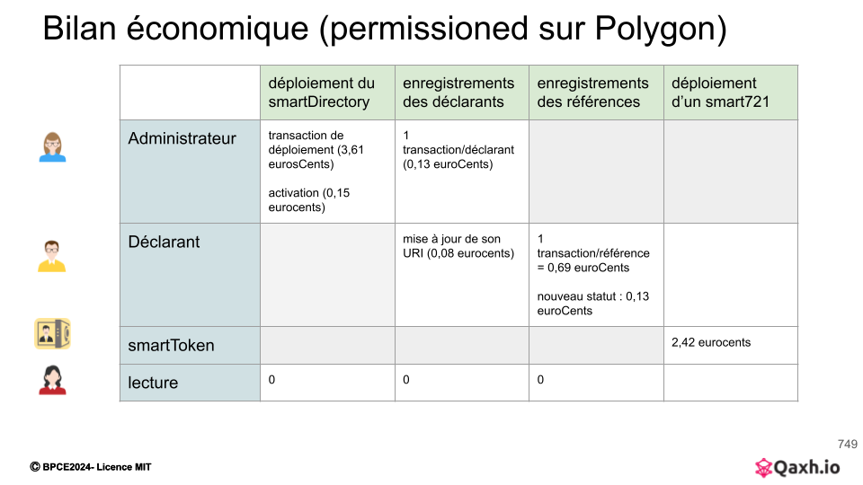

------------------------------------------------------------------------


App de démonstration du smartDirectory (alpha)
==============================================

L'application de démonstration du smartDirectory est une extension de l'application de test du projet Qaxh.io. Cette 
application a été développée en App Inventor 2 (AI2). Elle est composée de 2 écrans ("screen1" et "screen7"). Seul le 
"screen7" a été spécifiquement développé pour le projet smartDirectory.


### Périmètre de l'application

Cette application a eu pour objet de tester les API et l'ensemble des fonctions du smartDirectory dans un fonctionnement
nominal. Cela reste une application pour développeurs qui peut comporter des bogues.

### A propos d'App Inventor 2 (AI2)

AI2 est un langage de blocs mis au point par le [MIT](https://www.google.com/url?q=https://appinventor.mit.edu/&sa=D&source=editors&ust=1735324824959332&usg=AOvVaw2uxLKBg2j9pHq1L8qMj0hc) en utilisant l'éditeur de programmation visuel [BLOCKLY](https://www.google.com/url?q=https://developers.google.com/blockly?hl%3Dfr&sa=D&source=editors&ust=1735324824959752&usg=AOvVaw1WsHbYV6f7deAUNIP5OITA).

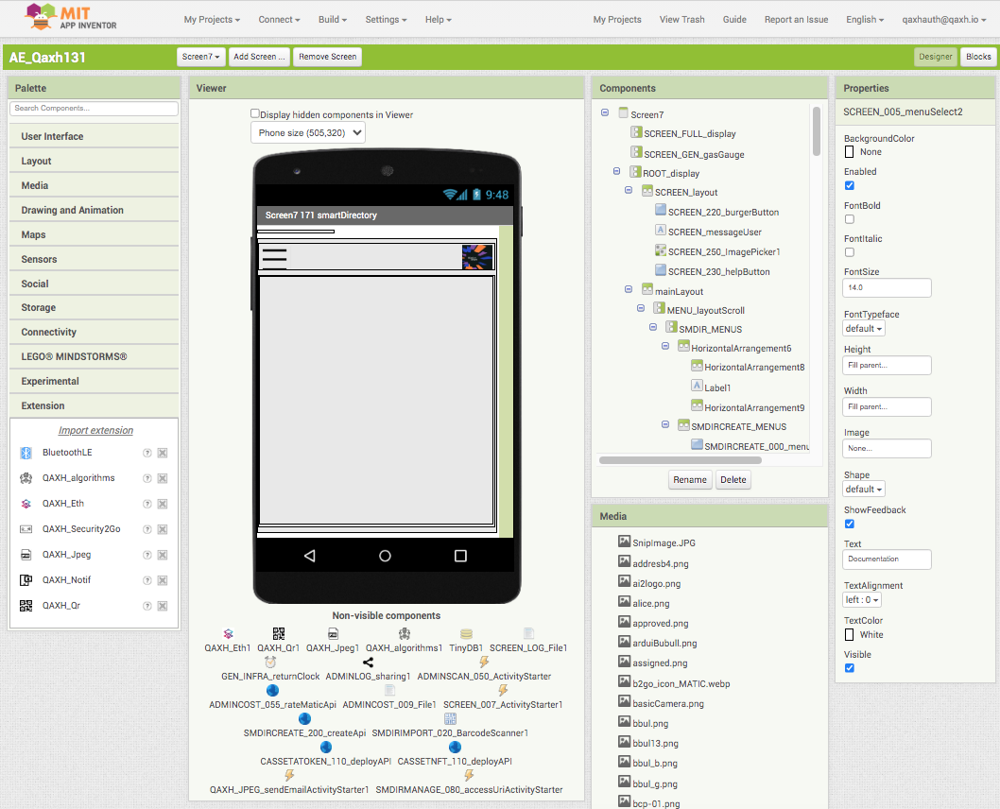

AI2 permet l'ajout d'extensions spécifiques (cf. tuile "import extension" en bas à gauche du screenshot ci-dessus avec 
l'entrée "QAXH\_Eth") qui permettent l'accès aux différentes fonctions des blockchains EVM.

Le choix d'un outil de programmation visuel a été fait pour favoriser ne approche "low code" devant favoriser 
l'appropriation des contraintes et opportunités de la blockchain par les équipes métiers.

### Code source et recompilation de l'application

Le code source est fourni sous forme d'un fichier .aia il est à charger ("import") dans le site web de 
programmation/compilation [http://qaxh2020.qaxh.io:8888](https://www.google.com/url?q=http://qaxh2020.qaxh.io:8888&sa=D&source=editors&ust=1735324824960866&usg=AOvVaw0VHOUR48B5s12mm0qeCQ-u) (créer un compte de type "gmail" sans nécessairement avoir
besoin d'une adresse gmail; pas de vérification de la validité de l'adresse.

Après chargement l'interface de programmation est similaire à android studio en beaucoup plus simple. La première page 
comme ci-dessus est un composeur d'interface utilisateur, le "code" est visible en cliquant en haut à droite sur 
"blocks", on se retrouve avec un langage de type blockly.

Cette application à nécessité environ 5000 blocks.

La compilation s'effectue en cliquant sur "build" en haut dans le bandeau horizontal de menus, un fichier de type .apk 
(application android) est ensuite proposé en téléchargement via un qrcode. N.B. : après téléchargement/transfert sur 
smartphone de l'apk, il faudra valider autoriser la première fois sur android l'installation d'application en provenance
de de sources différentes du playstore de google.

### Première ouverture de l'App

L'APK disponible sur le GitHub (dossier "Android") permet d'essayer immédiatement l'application, vous pouvez vous 
l'envoyer par email et l'ouvrir sur votre android.

A la première ouverture, l'app initialise un nouveau compte (couple clé privée, adresse) et demande à l'utilisateur de 
choisir la blockchain. Seule la chaîne AMOY est proposée.

Il revient ensuite à l'utilisateur de sélectionner dans le menu "smartMission" pour accéder à l'écran du smartDirectory.

### Le menu principal

Il comporte 3 sections :

* la création et la gestion d'un ou plusieurs smartDirectory,
* la visualisation des écosystèmes à partir d'un smartDirectory,
* la création de smartTokens.

En complément l'APP permet :

* la consultation d'une log pour le développeur,
* le listage des transactions manipuler par l'APP et un lien direct vers un Explorer AMOY,
* une log des coûts permettant de reconstituer un bilan économique,
* un accès à la documentation.


Menus Administrateur
-----------------------------------------------------------------------------------------------

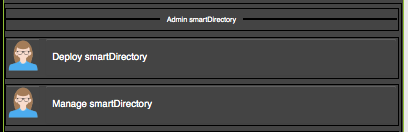

### Deploy smartDirectory

Cet écran permet de saisir les paramètres nécessaires à l'appel de l'API de déploiement d'un smartDirectory.

A réception du retour du serveur, l'APP attend le minage de la transaction et propose l'activation du smartDirectory.

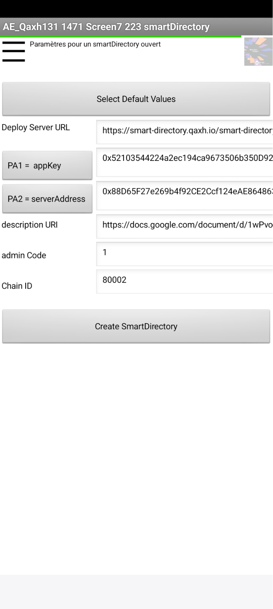

------------------------------------------------------------------------


### Manage smartDirectory

Cet écran offre la possibilité d'ajouter un nouveau déclarant (registrant) lorsque le smartDirectory est administré.

Cet écran permet aussi d'invalider un déclarant si besoin et bloquer un smartDirectory.

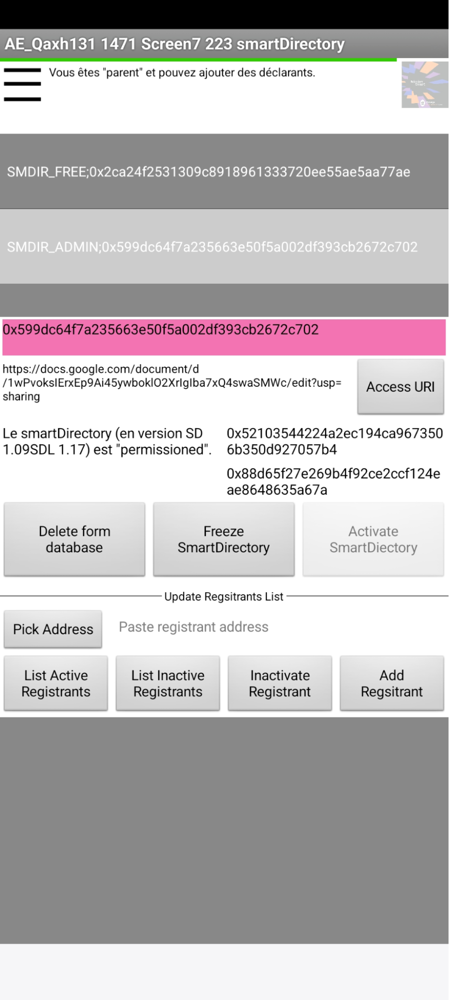

------------------------------------------------------------------------


Menus "Registrant"
---------------------------------------------------------------------------------------------

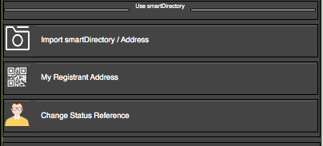

### Import smartDirectory

Cet écran permet d'importer l'adresse d'un smartDirectory créé par une autre entité. Si le type est de "42" l'adresse 
sera enregistrée comme un smartDirectory sinon comme une EOA.

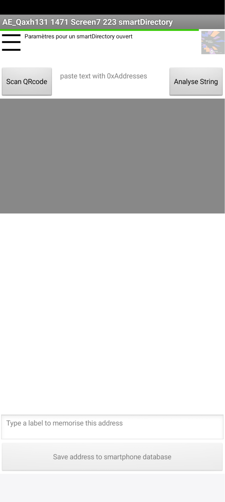

------------------------------------------------------------------------


### My RegistrantAddress

Cet écran permet l'affichage de son adresse de déclarant et son envoi, accompagné éventuellement d'une adresse de 
smartDirectory.

En complément, l'écran permet la mise à jour de l'URI d'un déclarant déjà enregistré dans un smartDirectory.

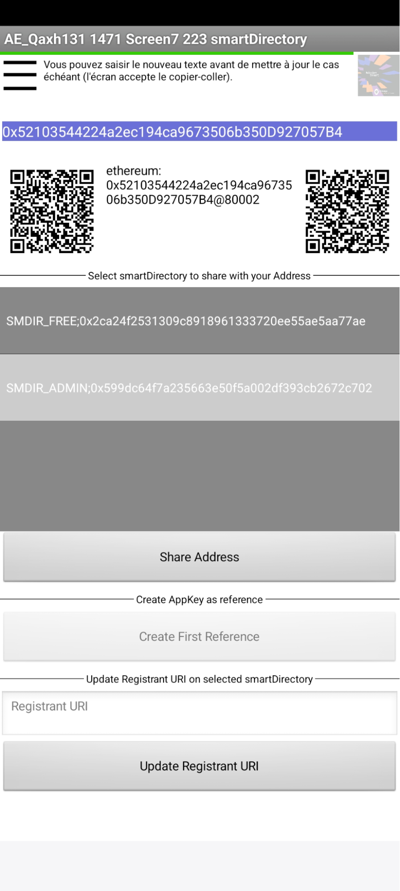

------------------------------------------------------------------------


### Change Status Reference

Cet écran liste les références déclarées par l'utilisateur de l'APP et permet la mise à jour du statut de chaque référence.

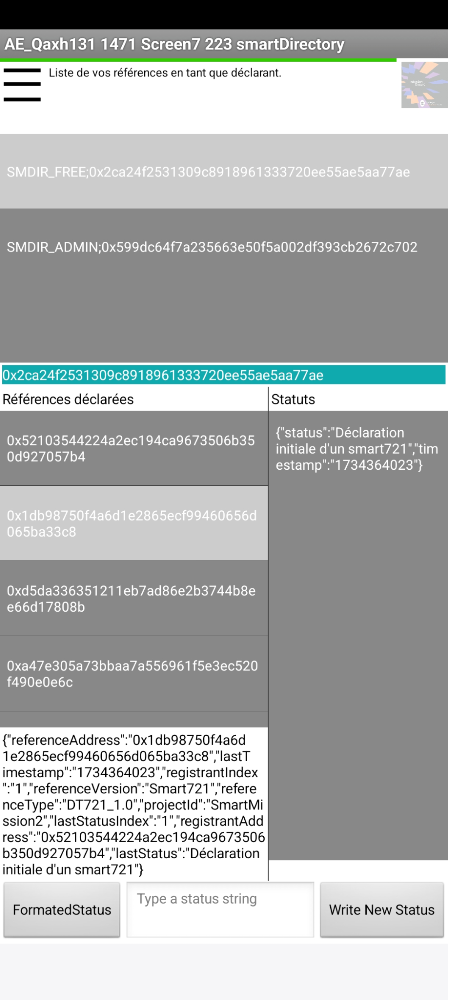

------------------------------------------------------------------------


Menus Utilisateur
--------------------------------------------------------------------------------------------

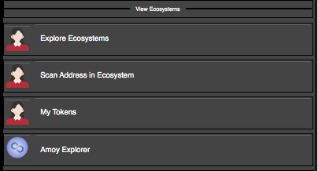

### Explore Ecosystems 

Cet écran offre une vision des références par smartDirectory. En cliquant sur les différentes listes, il est possible 
d'accéder à l'ensemble des éléments du smartDirectory.

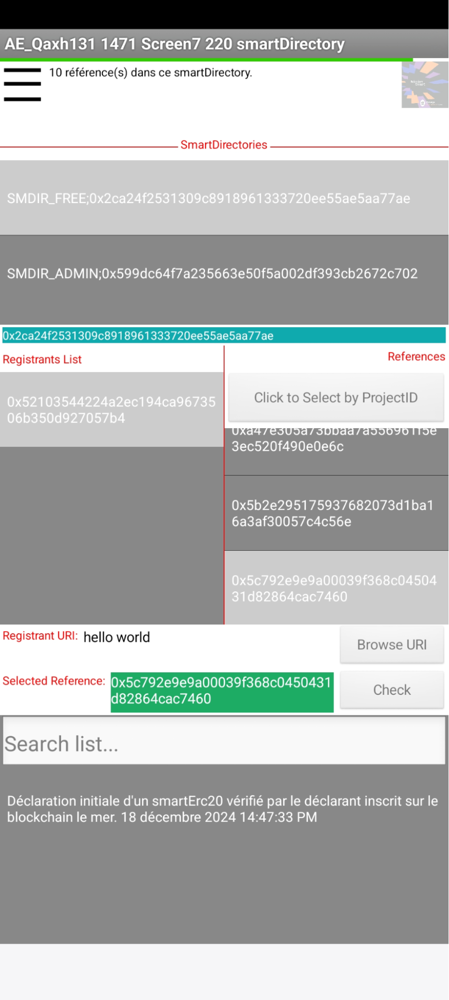

### Scan Address in Ecosystem

Cet écran permet la saisie d'une adresse quelconque et va analyser les différents smartDirectories connus pour 
identifier d'éventuelles déclarations. Cet écran se scrolle en horizontal pour accéder à l'ensemble des informations :

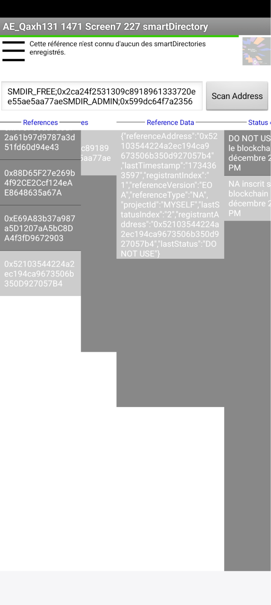

### My Tokens

Cet écran va scanner dans les smartDirectories connus les tokens fongibles (ERC20 et ERC20A) dans lesquels la balance de
l'utilisateur est différente de zéro.

### Faucet / Explorer Amoy

L'ensemble des transactions et adresses sont mémorisées dans le code et ainsi disponibles en liste dans cet écran. Il 
suffit de cliquer sur une des lignes pour accéder directement à l'explorateur AMOY. Ceci permet à un utilisateur "I do 
my own checks" d'avoir un contrôle indépendant de l'application.

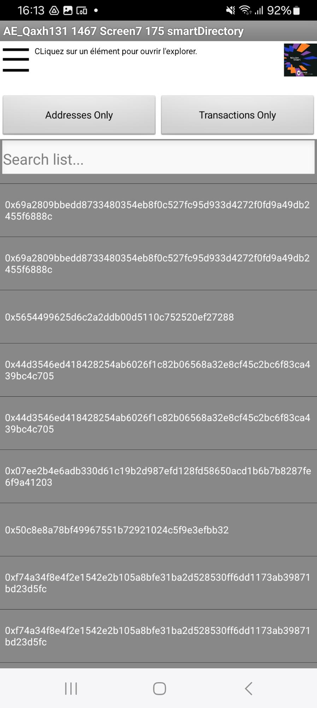
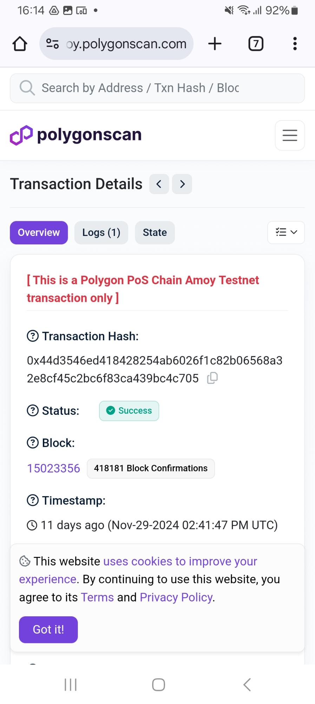

Deux boutons permettent respectivement de filtrer les adresses ou les transactions.


Menus smartTokens
--------------------------------------------------------------------------------------------

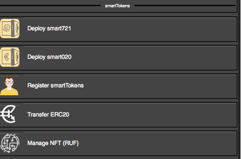

Cet écran permet de déployer une série de smartTokens et de les référencer pour faciliter les tests et la visualisation 
des écosystèmes.

L'onglet "Manage NFT" n'est pas actif car incomplet.

------------------------------------------------------------------------


### Deploy smart721

Permet le déploiement d'un ERC721 avec les fonctions complémentaires de smartToken :

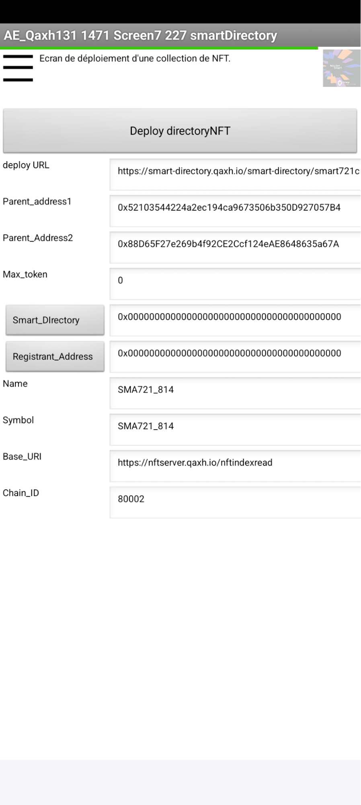
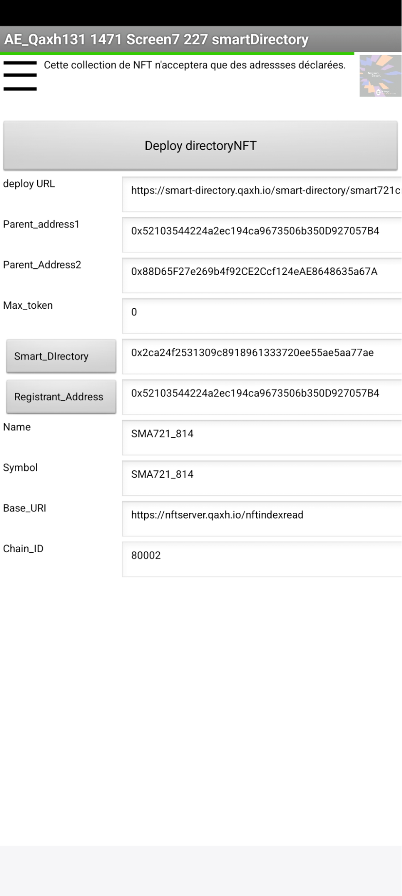

Un ERC721 avec un paramétrage ne demandant pas de contrôle à gauche et un avec un contrôle de smartDirectory et de 
"registrant".

------------------------------------------------------------------------


### Deploy smart020 

Permet le déploiement d'un ERC20 avec les fonctions complémentaires de smartToken :

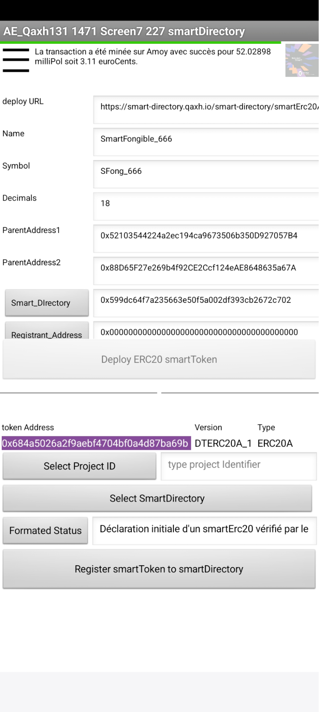

Un token fongible avec contrôle uniquement de la présence des adresse dans un smartDirectrory 
("regsitrant" à 0x0000...") avec l'apparition de l'écran de déclaration en retour de l'API du serveur.

------------------------------------------------------------------------


### Register smartToken

Permet de référencer une adresse de smartToken nouvellement créée (ou de saisir une adresse externe). L'écran reprend la
liste des tokens créés. Il suffit de sélectionner pour accéder à la portion de l'écran pour déclarer une référence :

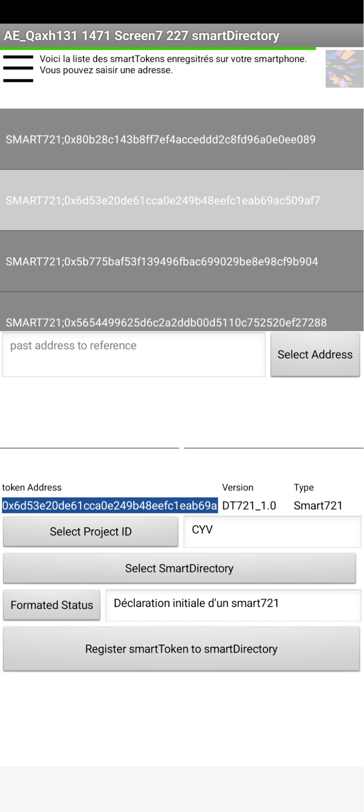

------------------------------------------------------------------------

### Transfer ERC20

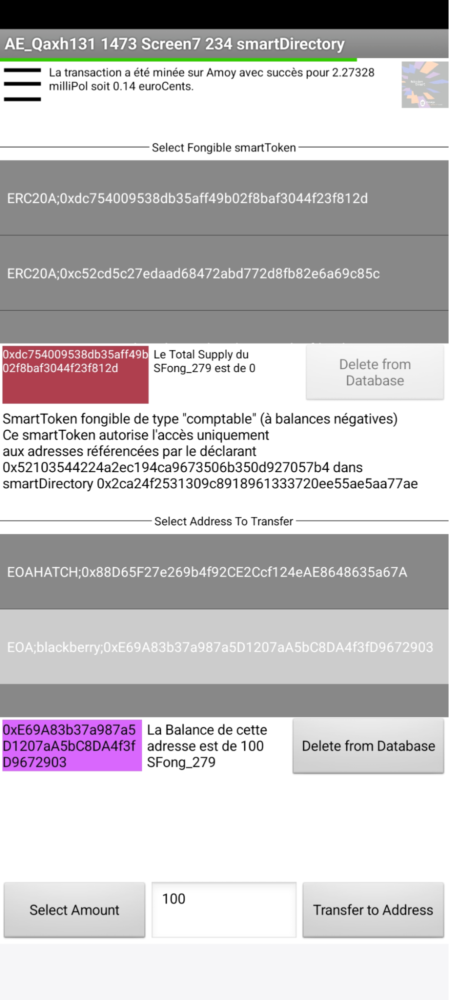

------------------------------------------------------------------------

Menu d'administration de l'APP
--------------------------------

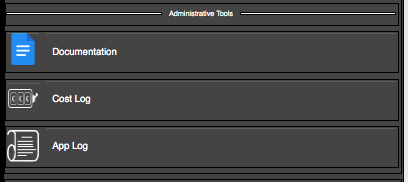

### Documentation

Ce menu fournit un lien vers ce fichier de documentation dans une fenêtre externe.


------------------------------------------------------------------------


### Cost Log

Tous les TxHash des transactions sont mémorisés et lors de leur analyse, le coût de la transaction est conservé dans un 
journal dédié (cost log). Ce journal est structuré sous forme de CSV ce qui doit permettre une utilisation plus facile 
sous Excel (un filtrage manuel est sûrement nécessaire.)

En complément des coûts de GAS, un équivalent Euro/Ether et Euro/POL est calculé sur la base d'API donnant le taux au 
lancement de l'APP.

Cette costlog permet une vision exhaustive des coûts car les API de déploiement retournent systématiquement le txHash :

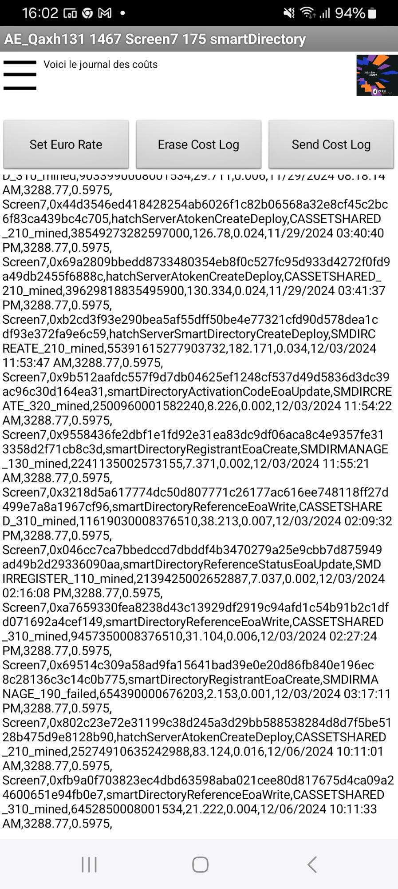

Une fois accédé, cet écran permet de mettre à jour les informations de Eur/Eth et Eur/POL, d'effacer le fichier et 
d'envoyer le fichier.

Exemple de résultat avec Excel :

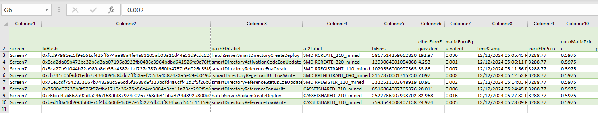

l

### App Log

Au choix du développeur, différents éléments sont enregistrés pendant le déroulement des blocks. En particulier, si la 
fonction de LOG est appelée, elle permet de mémoriser le dernier bloc avant un éventuel plantage de l'application (cela 
arrive !).

La visualisation de la Log ne change rien à l'écran en cours, il est donc possible de retourner sur l'écran de départ.

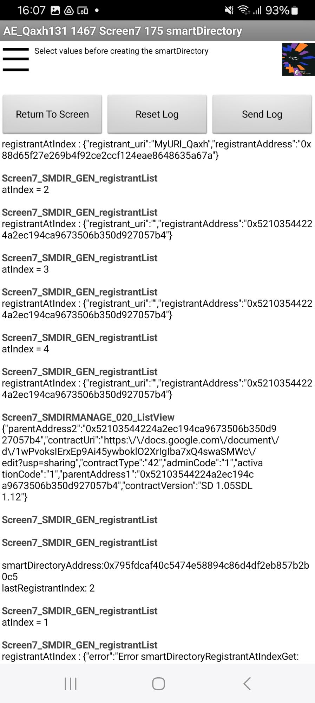

------------------------------------------------------------------------

Compléments pour Citizen Developper
-----------------------------------

L'app a été créée en AI2 pour faciliter les évolutions et les mises au point dans un cadre de démonstration, de 
validation du fonctionnement et de garantie que l'ensemble présente une forme de pertinence pour un utilisateur 
non-développeur.

### Mise à jour de l'App

Pour mettre à jour l'application, il est nécessaire d'utiliser le fichier .aia disponible sur le GitHub. Pour éditer ce 
fichier, il n'est pas possible d'utiliser directement l'éditeur du [MIT](https://www.google.com/url?q=https://accounts.google.com/o/oauth2/v2/auth?response_type%3Dcode%26client_id%3D835377224499-p6kuf1tm823g8vmvkpl7urs5r0gfasns.apps.googleusercontent.com%26scope%3Dopenid%2520email%26redirect_uri%3Dhttps://login.appinventor.mit.edu/return%26state%3D350364e7-160f-4915-b42b-436cafc71ee4%26nonce%3D82fc5d15-4066-4004-8be6-4fac1b389f11%26&sa=D&source=editors&ust=1735324824974382&usg=AOvVaw2O4nAHoFJQyYWnHzhNTGUo) qui présente des limites dans 
l'acceptation de taille de fichier. Il est donc nécessaire d'utiliser [l'éditeur du projetQaxh.io](https://www.google.com/url?q=http://qaxh2020.qaxh.io:8888/login/&sa=D&source=editors&ust=1735324824974939&usg=AOvVaw0V6XlWJ35_YbLT0za4jsGs).

Toute l'application "smartDirectory" se trouve sur le "screen7". Le "screen1" est repris du projet Qaxh.io avec 
désactivation des fonctions inutiles pour le projet pour ne garder que la création et la gestion des EOA, la gestion des
LOGS.

### Bonnes pratiques de survie dans le code

Le code fait plus de 5000 blocs. Pour s'y retrouver, l'éditeur possède 2 commandes importantes dans le menu clic-droit.

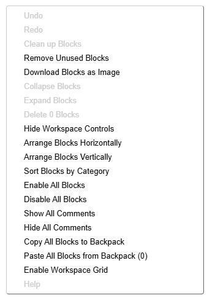

* Sort blocks by categories, permet de lister les blocks dans l'ordre alphabétiques de leurs appellation,
* puis Sort Blocks Vertically, permet de mettre tous les blocks en vertical ce qui simplifie la recherche.

Tous les éléments de l'interface sont nommés sous la forme de lettre pour un domaine de regroupement puis des chiffres 
qui permettent de suivre (à peu près) l'ordre chronologique des traitements.

### Interaction Blockchain

Comme toute application smartphone, il est nécessaire de gérer les
interactions clients dont la séquence est bien souvent aléatoire vu du
développeur.

Concernant les interactions écrans ou les interactions API, le langage
AI2 offrent toutes les facilités pour bien gérer cette programmation
événementielle.

En complément, il est aussi nécessaire de prendre en compte les interactions avec la blockchain. Celle-ci se fait de 
manière générique.

Au départ, il y a la récupération du TxHash d'une transaction (soit faite par l'APP soit en retour d'API). Ce TxHash est 
un paramètre d'un module générique qui nécessitent aussi :
  * le nom du block à lancer en cas de minage réussi,
  * le nom du block à lancer en cas de minage,
  * un libellé, défini par le développeur, utilisé pour la costLog permettant ainsi de voir l'origine de la transaction (nouveau NFT, transfert d'ERC20, changement de statut, ...).

Deux modules complémentaires permettent :

* de lire périodiquement la blockchain pour connaître l'état de la transaction, soit minée soit en erreur, soit "pending" et la lecture périodique continue.
* de router vers le block adéquat dès lors que la transaction est soit minée soit en erreur.

Le block de lecture périodique alimente en parallèle la costLog et la liste des transactions pour l'explorateur.

### Colorisation des adresses

Pour permettre à l'utilisateur de plus rapidement identifier des adresses, celles-ci peuvent être coloriser avec les 
principes suivants pour le calcul du RGB :

* R= caractères HEXA 29 et 28 de l'adresse
* G= caractères HEXA 38 et 39 de l'adresse
* B= caractères HEXA 34 et 35 de l'adresse

Attention si la clarté de ce nombre RGB est supérieur à 128, le fond est noir, sinon il est blanc :

La clarté se calcule suivant la formule : R\*0.3+G\*0.59+B\*0.11

------------------------------------------------------------------------


Le serveur de déploiement
-------------------------

Il est disponible sous le répertoire api. Ce serveur est écrit en python et est prévu pour être déployé derrière un 
reverse proxy de type nginx.

* Le fichier de configuration pour nginx est fourni (nginx-config-smart-directory).

* Un serveur de test est en ligne: [https://smart-directory.qaxh.io/smart-directory/ping](https://www.google.com/url?q=https://smart-directory.qaxh.io/smart-directory/ping&sa=D&source=editors&ust=1735324824979532&usg=AOvVaw2bH8FJ6QyiL_J3IlNcWLL0)

* Script d'installation de l'environnement python : install.sh  (à exécuter une fois).

* Script de mise en place de l'environnement : setup.sh (à exécuter une fois par session terminal)

* Script de lancement: init.sh . Le lancement utilise l'utilitaire screen (apt install screen)

* Code source dans app.py

Les api disponibles sont :

**Smartdirectorycreate**

        Arguments:
      
         \'parent\_address1\',
       
        \'parent\_address2\',
      
         \'contract\_uri\',
      
         \'admin\_code\',
      
         \'chain\_id\'


**smart721create**

    Arguments:
    
     \'chain\_id\',
    
     \'max\_token\',
    
     \'parent\_address1\',
    
     \'parent\_address2\',
    
     \'smart\_directory\',
    
     \'registrant\_address\',
    
     \'name\',
    
     \'symbol\',
    
     \'base\_uri\',


**smartErc20Acreate**

    Arguments:
    
     \'chain\_id\',
    
     \'parent\_address1\',
    
     \'parent\_address2\',
    
     \'smart\_directory\',
    
     \'registrant\_address\',
    
     \'name\',
    
     \'symbol\',
    
     \'token\_type\'


Ces api sont activés via l'application android, elles peuvent aussi l'être par du code python, par exemple:

------------------------------------------------------------------------

L'application web de consultation/supervision
---------------------------------------------

Un frontend web pour le smartDirectory est disponible dans le dossier "front" du projet sur Github. Merci de consulter 
le README.md dans ce dossier pour le déployer.


------------------------------------------------------------------------