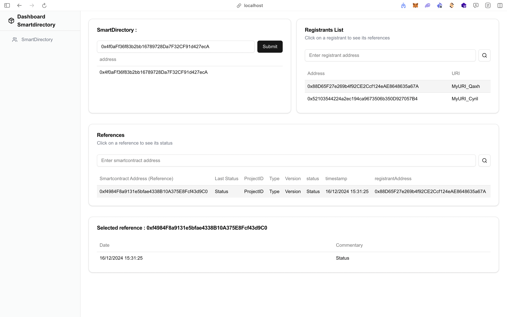
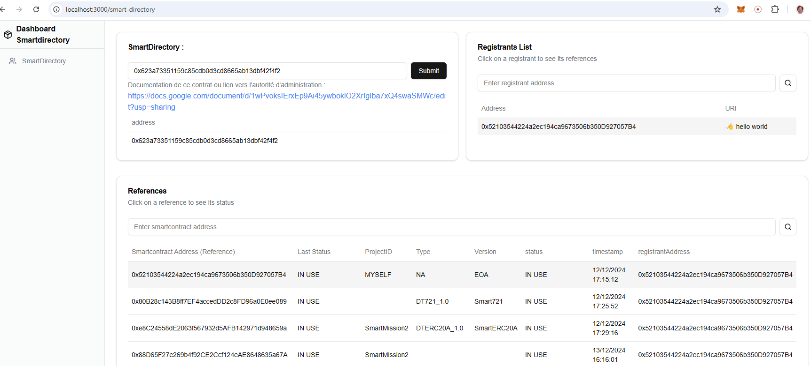

# L'application de supervision

## Prérequis

- [Node.js](https://nodejs.org/) (version 18.x ou supérieure)
- [npm](https://www.npmjs.com/) (version 10.x ou supérieure)

## Installation

1. Clonez le dépôt :

```bash
   git clone https://github.com/BPCE/smart-directory.git
   cd smart-directory/front
```

2. Exécutez le script install.sh :

```bash
   . ./install.sh
```

Ce script installera toutes les dépendances nécessaires et lancera le serveur de développement.

## Accéder au projet

L'application de supervision est accessible sur le serveur de développement :

```
http://localhost:3000/smart-directory
```

## Scripts npm

Ce sont les scripts standard d'un développement NPM :

- `npm run dev` : Lance le serveur de développement.
- `npm run build` : Crée une version de production du projet.
- `npm run start` : Lance le serveur de production.
- `npm run lint` : Exécute le linter pour vérifier le code.

## UI de l'application de supervision

L'application permet de lire toutes les informations contenues dans un smart directory, le prérequis étant de connaitre l'adresse du contrat.

L'adresse du smart directory étant entrée, la liste des registrants s'affiche, on peut aussi entrer un registrant particulier dans la case "Enter registrant address".

Pour un registrant donné, la liste de ses smart contracts référencés s'affiche. Il est aussi possible d'entrer une adresse de smart contract dans la case "Enter smartcontract address" meme si le registrant n'est pas identifié, c'est typiquement la manoeuvre que ferait un utilisateur qui voudrait authentifier une adresse de smart contract.

Lors de l'affichage du smart contract en référence, son dernier statut ("Last Status") est donné, l'utilisateur peut ainsi s'assurer que l'adresse est toujours
en activité (et non expirée).

L'historique des statuts peut aussi etre consultée.




