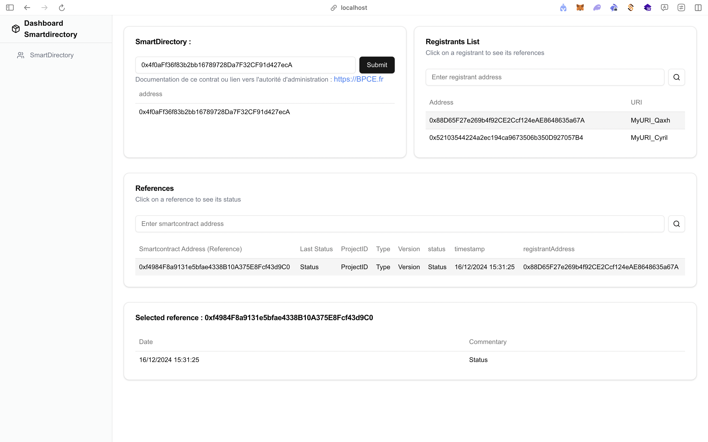

# L'application de supervision

## Prérequis

- [Node.js](https://nodejs.org/) (version 18.x ou supérieure)
- [npm](https://www.npmjs.com/) (version 10.x ou supérieure)

## Installation

1. Clonez le dépôt :

```bash
   git clone https://github.com/BPCE/smart-directory.git
   cd smart-directory/front
```

2. Exécutez le script install.sh :

```bash
   . ./install.sh
```

Ce script installera toutes les dépendances nécessaires et lancera le serveur de développement.

## Accéder au projet

L'application de supervision est accessible sur le serveur de développement :

```
http://localhost:3000
```

## Scripts npm

Voici quelques scripts npm utiles que vous pouvez utiliser :

- `npm run dev` : Lance le serveur de développement.
- `npm run build` : Crée une version de production du projet.
- `npm run start` : Lance le serveur de production.
- `npm run lint` : Exécute le linter pour vérifier le code.

## Screenshots du Dashboard



